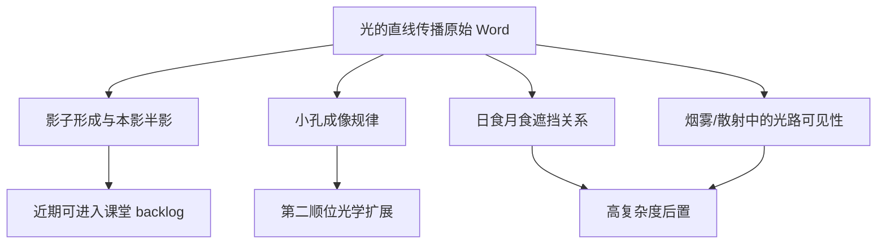

# 光的直线传播拆题与 backlog 收口

## Problem Frame

归档文档 `docs/archive/可视化教学/物理实验可视化/光学_2_光的直线传播.docx` 目前把多个层级完全不同的现象堆在同一个主题里：

- 影子形成、本影半影
- 小孔成像
- 日食月食
- 烟雾/灰尘中的光路可见性

如果直接把它们等价成一个页面，会同时引入：

- 两套完全不同的课堂主链：`遮挡成影` 与 `成像规律`
- 一套偏天文专题的扩展场景：`日食 / 月食`
- 一套偏介质与可见光路表达的扩展场景：`散射 / 烟雾`

这会让页面范围迅速失控，也会让“光在同种均匀介质中沿直线传播”这个核心结论被多种玩法稀释掉。

## Archive Findings

从归档内容看，当前 Word 实际上混合了四类负担完全不同的教学任务：

| 子题 | 课堂目标 | 主要变量 | 页面复杂度 | 当前判断 |
|---|---|---|---|---|
| 影子形成 / 本影半影 | 证明遮挡下的直线传播，理解点光源与面光源差异 | 光源类型、光源远近、物体与屏位置 | 低 | 近期最适合落地 |
| 小孔成像 | 理解倒立实像、像距物距和像高变化 | 物距 `u`、像距 `v`、小孔直径 | 中 | 适合在影子页之后单独做 |
| 日食 / 月食 | 把直线传播延伸到三体遮挡关系 | 三体位置、观测区域、食型 | 高 | 后置，不进入近期 active backlog |
| 烟雾 / 散射可见光路 | 解释“为什么平时看不到光路” | 介质杂质、粒子可见性 | 中高 | 后置，避免和基础页混做 |

## Requirements

### 产品边界

- R1. `光的直线传播` 不再作为单一页面进入开发或 catalog。
- R2. 必须先拆成清晰子题，再决定哪些进入近期教学排期。
- R3. 第一顺位子题必须足够直观，进入页面后 5 秒内能看懂“为什么这是直线传播”。

### 教学优先级

- R4. `影子形成 / 本影半影` 作为第一顺位近期主题进入 catalog，定位为下一轮可开始的几何光学实验页。
- R5. `小孔成像` 不和影子页混做，单独保留为第二顺位扩展主题。
- R6. `日食月食` 与 `散射 / 烟雾` 不进入近期 active backlog，保留为后置扩展主题。

### Catalog 收口

- R7. `web-app/app/data/teaching-catalog.ts` 需要直接体现拆题后的主题边界，而不是继续留一个含混的大主题占位。
- R8. 新增 topic 的状态要能直接看出：哪个是“规划中”，哪个只是“后续扩展”。

## Key Decisions

- **先做影子，不先做小孔成像。**
  - 影子形成最直接对应“光沿直线传播 + 遮挡成暗区”；
  - 页面变量最少，只需要光源、物体、屏和距离；
  - 更适合课堂首屏讲解，不会被公式和像距物距关系分散注意力。

- **小孔成像单独做，不和影子页合并。**
  - 虽然同属直线传播，但它已经引入 `倒立实像`、`像高变化`、`小孔大小与清晰度` 三条新的教学链路；
  - 合并到影子页里，会让“遮挡”与“成像”两套心智打架。

- **日食月食与散射展示一起后置。**
  - 日食月食需要额外的天文空间关系表达；
  - 散射需要额外的介质粒子与光路可见性表达；
  - 两者都不再属于“初中课堂首批基础直线传播页”的最短教学路径。

## Catalog Proposal

| topic id | 标题 | 状态 | 进入时机 | 说明 |
|---|---|---|---|---|
| `shadow-formation-lab` | 影子形成与本影半影 | `planned` | 近期可开始 | 作为“光的直线传播”第一顺位实验页 |
| `pinhole-imaging-lab` | 小孔成像规律观察 | `backlog` | 影子页之后 | 单独成页，不和影子混做 |
| `eclipse-scattering-lab` | 日食月食与光路可见性 | `backlog` | 更后阶段 | 合并管理天文遮挡与散射扩展 |

## Success Criteria

- `光的直线传播` 从一个过宽的归档名称，变成三个边界清晰的产品子题。
- catalog 中能直接看出：
  - 哪个是下一轮可开始的主题
  - 哪些还只是后续扩展
- 后续进入实现时，不再需要先争论“影子、小孔成像、日食月食要不要挤在同一页里”。

## Scope Boundaries

- 本轮只完成拆题与 backlog 收口，不直接实现新的光学实验页。
- 本轮不引入新的光学组件、路由组件或可视化舞台。
- 本轮不讨论高中光学专题，只处理当前初中物理 archive 里的这一个复合主题。

## Next Steps

- 下一轮如果继续推进光学，优先实现 `shadow-formation-lab`。
- `pinhole-imaging-lab` 在影子页落地后，再单独规划其 `物距 / 像距 / 像高` 教学链路。
- `eclipse-scattering-lab` 继续留在高复杂度后置队列，等待更成熟的场景与介质表达能力。
