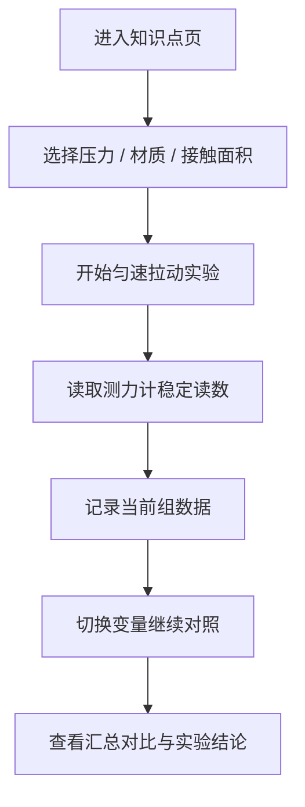

# 滑动摩擦力影响因素实验对齐

## Problem Frame

当前初中物理知识点中，`web-app/app/data/teaching-catalog.ts` 将现有实验页命名为“基础受力分析”，但归档资料与页面实现实际上都更接近“滑动摩擦力影响因素实验”。

这会带来两个直接问题：

- 知识点命名与归档资料不一致，后续内容整理、迭代分析和资产归类都会持续偏移
- 页面教学目标不聚焦，学生与老师进入页面后，难以在短时间内判断“这一页究竟要学滑动摩擦实验，还是学泛化受力分析”

本轮需要把当前模块正式收敛为“滑动摩擦力影响因素实验”，让命名、路由、文案、可视化结构和课堂流程重新对齐。

## Requirements

**知识点归档与命名**
- R1. 当前 `basic-force` 对应知识点必须正式对齐为“滑动摩擦力影响因素实验”，不再继续以“基础受力分析”作为展示名称。
- R2. 知识点摘要、标签、亮点、页面标题、路由解析和相关文案必须与“滑动摩擦力影响因素实验”一致。
- R3. 若当前仓库或已有访问路径仍引用旧的 `basic-force` 标识，应提供兼容处理，避免旧链接立即失效。

**教学结构与信息层级**
- R4. 页面默认教学目标必须突出“匀速拉动时，拉力 = 摩擦力”以及“滑动摩擦力与压力、粗糙程度有关，与接触面积无关”。
- R5. 页面主流程必须围绕课堂实验顺序组织：先看装置，再做单组测量，再做多组对照，最后得出结论。
- R6. 当前页面中不属于主实验结论的内容，尤其是泛化“受力分析”语义、过强的运动学叠层和容易分散注意力的玩法，必须降级为次要信息或移出主流程。

**可视化与交互**
- R7. 2D 视图必须作为主教学视图，优先承担装置示意、受力展示、测力计读数和对照结果呈现。
- R8. 3D 视图可以保留，但定位必须是“辅助观察实验场景”，不能抢占主教学结构。
- R9. 页面必须支持多组实验结果的记录与对照，结果区应优先使用数据表、对照卡或柱状对比，而不是默认以位移/速度曲线作为主结论展示。

## Success Criteria

- 用户首次进入页面后，5 秒内可以明确这是“滑动摩擦力影响因素实验”。
- 老师可以按“压力变化 / 材质变化 / 接触面积变化”完成至少 3 组课堂对照，不需要额外解释页面模式含义。
- 页面底部或结果区域能直接看出：
  - 压力增大，摩擦力增大
  - 表面越粗糙，摩擦力越大
  - 接触面积改变，摩擦力基本不变

## Scope Boundaries

- 本轮不把当前模块扩展成通用“基础受力分析”平台。
- 本轮不引入真实物理引擎或更复杂的动力学仿真。
- 本轮不新增独立知识点页面，只收敛并修正当前这一页的知识点定义与页面结构。

## Key Decisions

- 当前页面以归档文档 `docs/archive/可视化教学/物理实验可视化/力学_3_滑动摩擦力影响因素实验.docx` 作为教学内容主依据。
- “基础受力分析”作为更上位的泛化知识点，后续若要做，应单独立项，不再由当前页面承担。
- 当前模块允许保留历史实现中的部分扩展交互，但这些交互不能继续主导页面结构。

## Dependencies / Assumptions

- 归档文档中的实验原理、装置、变量和课堂流程是本轮页面收敛的主要来源。
- 当前仓库中 `motion-track` 与 `circuit-observer` 的沉浸式实验页结构可继续作为布局参考，但不能压过本实验的教学流程。

## Outstanding Questions

### Deferred to Planning
- [Affects R3][Technical] 旧 `basic-force` 标识应保留为兼容别名，还是直接整体重命名到新的 topic id。
- [Affects R6, R9][Technical] 当前“恒力拉动”和“手动拖动”是降级为辅助模式、折叠为扩展功能，还是在主页面中彻底移出。

## Next Steps

→ `/prompts:ce-plan` for structured implementation planning
