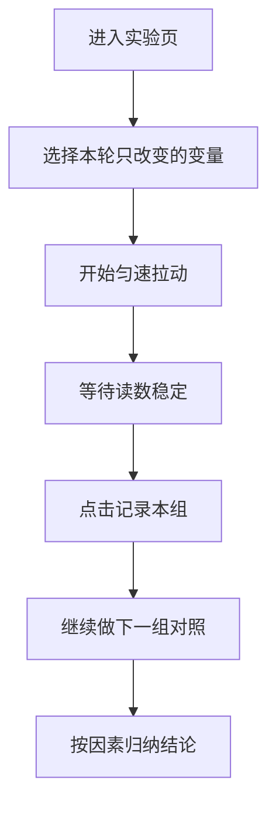

# 滑动摩擦力实验第二轮体验复盘

## Problem Frame

当前 `web-app/app/components/basic-force-lab.tsx` 已经完成了知识点命名对齐，也能展示摩擦力相关结论，但整体体验仍然更像“带很多模式的受力/运动演示页”，还不够像“老师带学生做滑动摩擦力影响因素实验”的课堂实验页。

本轮复盘的核心结论是：

- 页面过早揭晓理论值、公式和结论，削弱了实验探究感
- 页面骨架仍以模式切换、时间轴播放、状态面板为中心，而不是以控制变量实验为中心
- 当前记录与对照更像系统自动总结，而不是老师或学生主动完成一组实验后再归纳
- 3D 已经有场景感，但器材语义偏向工业测试机，不像课堂器材

如果继续优化，重点不应是再补几个控件，而是把页面主线从“讲答案 + 播动画”重排为“做实验 + 读数 + 记录 + 对照 + 得出结论”。

## Requirements

**课堂主线重排**
- R1. 默认首屏只服务一条课堂主线：选择单一变量 -> 开始匀速拉动 -> 等待读数稳定 -> 记录本组 -> 做下一组对照。
- R2. 默认首屏不得提前暴露“理论滑动摩擦”精确值、完整公式推导结果或最终结论文案。
- R3. `constant-pull`、`manual-drag`、时间轴拖拽、阶段跳转等扩展能力不得继续主导首屏；默认应降级到二级入口或折叠区。

**实验真实性与操作节奏**
- R4. 测量模式必须更像“做实验”而不是“看预设动画”；用户需要明显感知“刚起动不能记、匀速稳定后才能记”。
- R5. 记录结果必须改为显式动作；只有进入稳定读数阶段后，才允许“记录本组”。
- R6. 页面必须更明确地表达“本轮正在研究哪个因素”，并弱化自由试玩感，突出控制变量法。
- R7. 接触面积实验默认以“正放 / 侧放”满足课堂验证即可；更激进的摆放方式若保留，应降级为扩展内容。

**结果记录与课堂归纳**
- R8. 结果区必须从“最近几组自动记录”升级为更贴近课堂的实验记录区，优先按压力、材质、接触面积三类对照来组织。
- R9. 在只完成 0-1 组实验时，不应直接给完整结论；应先展示当前组读数或继续实验引导。
- R10. 课堂结论应在完成足够对照后再出现，并尽量保留老师主导归纳的空间，而不是让系统过早自动代讲。

**2D / 3D 角色收敛**
- R11. 2D 视图继续作为主教学视图，但需要去掉重复状态表达，减少顶部和底部同时争抢注意力的块。
- R12. 3D 视图只承担器材辅助观察，不承担主结论；器材语义应向“木板、木块、砝码、细线、弹簧测力计”收敛，而不是工业牵引设备。

## Success Criteria

- 用户首次进入页面后，5 秒内能明确这是一页“做滑动摩擦力实验”的页面，而不是多模式物理演示页。
- 完成第一组实验后，用户能自然理解“为什么要等匀速稳定后再记录读数”。
- 老师无需额外解释页面模式，就能带学生完成一轮压力对照或材质对照实验。
- 页面完成 2-3 组对照后，能明显看出“压力越大摩擦越大”“表面越粗糙摩擦越大”“接触面积改变时摩擦力基本不变”。
- 3D 模式切入后不会抢走课堂主线，只是帮助观察器材和场景。

## Scope Boundaries

- 本轮不引入新的物理引擎或更复杂的真实动力学模拟。
- 本轮不删除扩展观察能力，但会明确降级它们的默认层级。
- 本轮不新增新的知识点页面，只继续优化当前滑动摩擦力实验页。

## Key Decisions

- 默认页面必须优先服务“课堂实验模式”，而不是三模式并列。
- 公式和理论值的揭晓时机要后移，让实验过程先成立。
- “记录本组”应成为明确交互，而不是播放结束后的自动副作用。
- 记录区要从“最近几组”改为“课堂对照”，按研究因素组织。
- 3D 的目标不是更炫，而是更像真实课堂器材。

## Dependencies / Assumptions

- 归档文档 `docs/archive/可视化教学/物理实验可视化/力学_3_滑动摩擦力影响因素实验.docx` 仍是本页教学流程与器材语义的主依据。
- `web-app/app/components/motion-track-lab.tsx` 的沉浸式布局经验可继续借鉴，但不能再把“播放器/时间轴”心智带回当前实验页。

## Outstanding Questions

### Deferred to Planning
- [Affects R3, R6][Product] 默认首屏是完全自由调参，还是带一个“按课堂推荐顺序走”的轻引导实验序列。
- [Affects R7][Product] `竖放` 是否保留为扩展观察项，还是本轮直接从默认课堂实验中移除。

## Next Steps

→ `/prompts:ce-plan` for structured implementation planning
