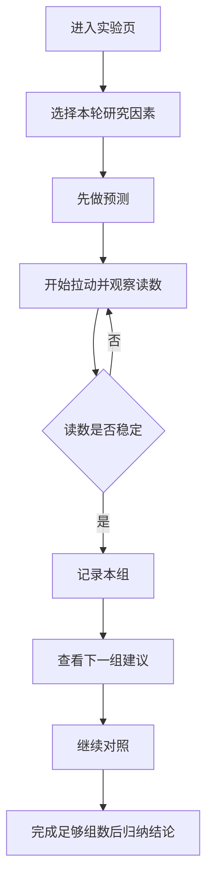

# 滑动摩擦力实验第三轮教学化优化

## Problem Frame

当前 `web-app/app/components/basic-force-lab.tsx` 已经完成了知识点对齐和第二轮课堂流程重排，页面已经从“多模式受力演示页”收敛为“课堂控制变量实验页”，老师可以带着学生完成一轮基础演示。

但从教学体验看，这一页仍然更像“老师操作的软件”，还不够像“学生顺着就能做完一轮实验的课堂实验单”。

当前主要问题有：

- 顶部步骤仍可直接跳阶段，容易让学生绕过实验过程
- 公式与原理出现得偏早，容易把页面变成“先看答案，再做实验验证”
- 课堂结论仍偏主动输出，老师和学生自己归纳的空间不够
- “可记录”更像页面预设相位，而不够像真实实验中的“读数稳定”
- 2D 主舞台信息仍偏密，学生容易先看 UI，而不是先看器材、读数和变量

这轮优化的目标不是推翻第二轮，而是把第二轮已经建立的课堂骨架继续教学化：让默认体验从“老师可演示”提升到“学生也能顺着完成探究”。

## Requirements

**学生探究优先**
- R1. 默认课堂入口必须优先保护完整实验链路：选变量、观察、稳定、记录、对照、归纳。
- R2. 顶部步骤条默认只承担“当前进度提示”，不得继续作为学生可直接跳阶段的主交互。
- R3. 扩展观察能力（3D、恒力拉动、手动拖动、阶段跳转）必须继续保留，但默认下沉到教师工具或扩展区域，不与课堂主操作并列抢注意力。

**原理揭示时机**
- R4. 默认首屏不得直接完整暴露 `f = μN`、`N = G` 和正式课堂结论。
- R5. 页面应先帮助学生完成至少一组有效测量，再逐步揭示“匀速时拉力等于滑动摩擦力”以及更完整的公式关系。
- R6. 原理与公式的展示应支持“后置揭示”，即先实验、再解释，而不是先解释、再验证。

**测量真实性**
- R7. “记录本组”资格不能只依赖预设播放阶段，应更明确体现“读数先趋稳，再可记录”的观测过程。
- R8. 当研究变量变化或实验被中断时，页面必须明确告知当前读数失效，并要求重新测量。
- R9. 页面必须把“当前研究因素”“本组条件”“当前是否可记”表达得比现在更直接，让学生不需要额外解释就能知道下一步做什么。

**结果组织与课堂归纳**
- R10. 记录区应从“已记录的数据展示”继续收敛成“预制课堂实验单”，让学生看到当前因素还差哪几组未完成。
- R11. 课堂结论必须分层表达：未完成对照时不给正式结论，完成部分数据时只给趋势提示，完成足够组数后才给正式归纳。
- R12. 页面应在记录完一组后给出“下一组建议”或“还缺哪组”，帮助学生完成完整控制变量对照。

**主舞台减负**
- R13. 2D 主舞台应继续保持科技感，但信息密度必须下降，默认注意力中心要回到器材、读数和当前任务提示。
- R14. 非必要的进度条、状态徽标、重复说明和强提示块应继续下沉或弱化，避免和器材主视觉争抢注意力。

## Success Criteria

- 学生首次进入页面后，5 秒内能知道“先改哪个变量、接下来要做什么、什么时候才能记数”。
- 学生在没有老师逐项解释模式的前提下，能够自主完成一轮压力对照的 2-3 组实验。
- 页面不会在第一组记录前就直接给出完整公式和结论。
- 记录 1 组、2 组、完整组数时，页面反馈层级有明显差异，不再统一用“系统结论”覆盖全部阶段。
- 2D 主舞台的第一注意力点是器材和读数，而不是状态条、步骤条或说明块。

## Scope Boundaries

- 本轮不新增新的物理知识点页面，只继续优化当前滑动摩擦力实验页。
- 本轮不引入新的物理引擎，也不重做 Three.js / 2D 渲染边界。
- 本轮不引入后端、云同步或学生账号体系。
- 本轮不追求严格真实实验误差建模，只追求更贴近课堂的读数稳定与记录心智。

## Key Decisions

- 默认体验以“学生探究安全”为先，教师快捷操作可以保留，但必须下沉。
- 公式与结论要后置揭示，教学顺序改为“先观察和记录，再归纳原理”。
- 课堂记录区要从“展示结果”继续升级为“引导完成整张实验单”。
- “稳定可记录”要更像实验观测门槛，而不是单纯的动画阶段门槛。

## Dependencies / Assumptions

- `docs/archive/可视化教学/物理实验可视化/力学_3_滑动摩擦力影响因素实验.docx` 仍是本页课堂流程、变量组织与结论顺序的主依据。
- `docs/plans/2026-07-24-002-refactor-sliding-friction-classroom-flow-plan.md` 已建立课堂骨架，这一轮在其基础上做教学化收敛，而不是重新回到多模式演示页。

## Outstanding Questions

### Deferred to Planning
- [Affects R2, R3][Product] 顶部步骤条、阶段跳转和扩展模式是统一放入“教师工具”，还是拆成两个独立的二级入口更清晰。
- [Affects R7][Technical] “读数稳定”采用时间窗 + 波动阈值、趋势收敛阈值，还是在现有阶段状态上叠加轻量稳定判定。
- [Affects R10, R12][Product] 记录区是默认展示当前研究因素的预制实验单，还是同时展示三类因素但只高亮当前因素。

## Next Steps

→ `/prompts:ce-plan` for structured implementation planning
