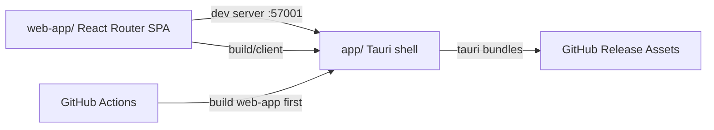

# feat: Establish Tauri app module for desktop delivery

## Overview

为仓库新增根目录 `app/` 模块，使用 Tauri 2 将现有 `web-app/` 作为共享前端渲染层接入桌面端，并补齐 GitHub Actions 桌面构建发布流程。

本轮不复制 `web-app/` 的页面源码到 `app/`，而是让 `app/` 作为 **桌面宿主层**，直接消费 `web-app/` 的开发服务与生产构建产物。这样后续 `web-app/` 与 `app/` 的功能保持同步是“结构上天然成立”的，而不是靠双份代码人工同步。

## Problem Frame

当前仓库已有 `web-app/` 正式承载 PC/H5 的 React Router Web 前端，但还没有桌面应用交付能力。用户已经确认接下来要用 Tauri 开发桌面端，并要求：

- 新模块直接命名为 `app/`
- 桌面端要基于现有 `web-app/` 演进
- 后续 `web-app/` 与 `app/` 功能需要同步
- 使用 GitHub Actions 进行跨平台桌面构建
- 构建组织方式可以参考 `~/code/App-Manager`

真正需要解决的核心不是“再起一个前端项目”，而是：

1. 如何让桌面端与 Web 端**共享同一套前端实现**
2. 如何以尽量小的改动引入 Tauri 宿主层
3. 如何在仓库级补齐跨平台桌面构建流水线

## Requirements Trace

- R1. 新增根目录 `app/` 模块，作为桌面端唯一宿主模块。
- R2. `app/` 基于 Tauri 2 搭建，而不是 Electron。
- R3. 现有 `web-app/` 保持为 Web 端入口，不做功能分叉。
- R4. `app/` 与 `web-app/` 未来功能同步要尽量自动化、结构化。
- R5. 桌面端开发模式下可直接复用 `web-app/` 开发服务。
- R6. 桌面端生产构建可直接消费 `web-app/` 构建产物。
- R7. 使用 GitHub Actions 构建 macOS / Windows / Linux 桌面包。
- R8. GitHub Actions 的组织方式参考 `App-Manager`，但适配 Tauri 技术栈。
- R9. 补齐桌面端文档与仓库级常用脚本。

## Scope Boundaries

- 本轮不把 `web-app/` 页面源码整体搬进 `app/`。
- 本轮不引入桌面专属业务功能（托盘、自动更新、系统菜单、原生文件能力等）。
- 本轮不改造 `web-app/` 的现有路由、UI、可视化业务逻辑。
- 本轮不做代码级共享包抽离，除非接入 Tauri 时发现必要阻塞。
- 本轮先完成桌面宿主与 CI 基础设施，后续再按业务节奏增加桌面能力。

## Context & Research

### Relevant Code and Patterns

- `web-app/package.json`：当前 Web 端使用 `React Router 8 + React 19 + TypeScript + Vite 8`。
- `web-app/react-router.config.ts`：已关闭 SSR，当前为 SPA 模式，适合直接作为 Tauri 前端产物。
- `web-app/vite.config.ts`：当前构建由 React Router Vite 插件承接，没有额外服务端依赖。
- `docs/plans/Web-App-模块规划.md`：已明确 `web-app/` 是当前主 Web 前端模块。
- `AGENTS.md`：要求跨模块任务优先先规划再执行，且所有路径用仓库相对路径。

### External References

- Tauri 2 现有前端接入方式：官方文档给出 `beforeDevCommand`、`beforeBuildCommand`、`devUrl`、`frontendDist` 组合方式。
- Tauri 2 GitHub Actions：官方文档建议使用 `tauri-apps/tauri-action` 做跨平台打包与 GitHub Release 发布。
- `~/code/App-Manager/.github/workflows/release-desktop.yml`：可复用其“校验 -> 多平台矩阵构建 -> 汇总发布”的流水线组织思路，但具体构建动作用 Tauri 版本替换。

### Institutional Learnings

- `docs/solutions/` 当前为空，未发现可复用的历史桌面端方案。

## Key Technical Decisions

- **采用“`web-app/` 继续做唯一前端源码，`app/` 只做 Tauri 宿主”的双模块结构。**
  - 理由：这是当前满足“Web 与桌面功能同步”成本最低、维护性最好的方案。

- **`app/src-tauri/tauri.conf.json` 直接指向 `web-app/` 的开发地址与构建产物。**
  - 开发态：`devUrl = http://127.0.0.1:57001`
  - 生产态：`frontendDist = ../../web-app/build/client`
  - 理由：不复制页面代码，不引入第二份前端工程。

- **保留 `web-app/` 现有构建链，不为 Tauri 重写前端架构。**
  - 理由：当前 Web 前端已稳定演进中，桌面端应尽量“贴附”其现有输出。

- **`app/` 先只提供最小桌面宿主与窗口配置，不提前接入原生插件。**
  - 理由：本轮目标是打通桌面交付链路，而不是扩展桌面专属能力。

- **GitHub Actions 采用 tag 驱动发布，并按平台矩阵构建。**
  - 理由：这与 `App-Manager` 当前发布节奏一致，也更适合桌面安装包资产管理。

## High-Level Technical Design

## Implementation Units

- [x] **Unit 1: 创建 `app/` Tauri 宿主模块**

**Goal:** 建立最小可运行的 Tauri 2 桌面模块，并让它接入现有 `web-app/`。

**Requirements:** R1, R2, R3, R4, R5, R6

**Dependencies:** None

**Files:**
- Create: `app/package.json`
- Create: `app/README.md`
- Create: `app/src-tauri/Cargo.toml`
- Create: `app/src-tauri/build.rs`
- Create: `app/src-tauri/tauri.conf.json`
- Create: `app/src-tauri/src/lib.rs`
- Create: `app/src-tauri/src/main.rs`
- Create: `app/src-tauri/capabilities/default.json`
- Create: `app/src-tauri/icons/*`
- Modify: `.gitignore`

**Approach:**
- 用 Tauri 2 最小宿主结构创建 `app/`。
- 在 `tauri.conf.json` 中通过 `beforeDevCommand` / `beforeBuildCommand` 复用 `web-app/`。
- `frontendDist` 指向 `web-app/build/client`。
- 窗口名、标题、图标先采用当前品牌资源。

**Patterns to follow:**
- Tauri 2 官方现有前端接入配置
- 本机已有 Tauri 项目中的 `src-tauri` 文件组织

**Test scenarios:**
- Happy path — `app/` 可拉起并加载 `web-app` 开发地址。
- Integration — `app/` 生产构建时能正确读取 `web-app/build/client` 作为前端静态产物。

**Verification:**
- `app/` 能本地启动桌面窗口。
- 桌面窗口展示的是现有 `web-app` 页面，而不是单独的占位页。

- [x] **Unit 2: 补充仓库级脚本与桌面开发说明**

**Goal:** 让仓库层面能明确启动 Web 与桌面开发流，并把同步关系文档化。

**Requirements:** R3, R4, R5, R9

**Dependencies:** Unit 1

**Files:**
- Create or Modify: `package.json`
- Modify: `web-app/README.md`
- Modify: `docs/plans/Web-App-模块规划.md`

**Approach:**
- 在根目录补充便捷脚本，统一触发 `web-app` 与 `app` 常用命令。
- 明确写出：`web-app/` 是唯一前端业务源码，`app/` 是桌面宿主层。

**Patterns to follow:**
- 仓库现有多模块根目录组织方式

**Test scenarios:**
- Happy path — 根脚本可以正确转发到模块命令。

**Verification:**
- 开发者能从根目录快速理解并执行桌面开发流程。

- [x] **Unit 3: 增加 GitHub Actions 桌面构建发布流程**

**Goal:** 建立适配 Tauri 的桌面构建工作流，参考 `App-Manager` 的发布结构。

**Requirements:** R7, R8, R9

**Dependencies:** Unit 1

**Files:**
- Create: `.github/workflows/release-app.yml`

**Approach:**
- 保留 `App-Manager` 的多平台矩阵思路：
  - tag 校验
  - 多平台构建
  - GitHub Release 发布
- 但具体构建实现改为：
  - 安装 `web-app/` 与 `app/` 依赖
  - 安装 Rust
  - Linux 安装 Tauri 所需系统库
  - 用 `tauri-apps/tauri-action` 产出桌面包

**Patterns to follow:**
- `~/code/App-Manager/.github/workflows/release-desktop.yml`
- Tauri 官方 GitHub Actions 文档

**Test scenarios:**
- Integration — Workflow YAML 中的工作目录、依赖安装路径、前端构建路径与 `app/` + `web-app/` 结构保持一致。
- Error path — 缺少 tag 或版本不匹配时，workflow 会在早期失败。

**Verification:**
- 仓库具备可用于桌面发布的 Actions 工作流。
- 发布流表达清晰，后续可直接接入真实 tag 发布。

## Risks and Mitigations

- **风险：`web-app/` 未来如果出现桌面专属能力需求，纯宿主方案可能不够。**
  - 缓解：本轮先保证共享前端链路打通；后续若需要原生桥接，再在共享源码中按环境分支引入。

- **风险：当前仓库不是 workspace，模块间命令引用路径容易写错。**
  - 缓解：所有命令显式使用相对路径或 `npm --prefix`，并通过本地构建验证。

- **风险：Linux runner 缺少 Tauri 系统依赖导致 CI 失败。**
  - 缓解：按官方文档在 workflow 中显式安装 `libwebkit2gtk-4.1-dev` 等依赖。

## Execution Notes

- 这是一个 **Standard / Deep** 级别的跨模块工程化任务。
- 执行时优先保证 `web-app/` 继续是唯一前端源码来源。
- 若实施中发现必须抽共享包，作为额外决策记录到后续计划或提交说明中，不在本计划默认范围内先做过度抽象。
