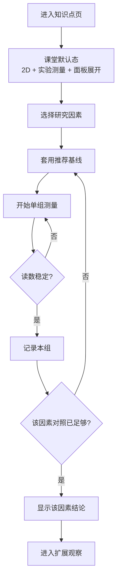

# refactor: Rebuild sliding friction classroom flow

## Overview

对 `web-app` 中当前滑动摩擦力实验页做第二轮重构，把默认体验从“多模式受力/运动演示页”收敛为“课堂控制变量实验页”。

本轮不会更换技术栈，也不会重做路由、topic 或 2D/3D 基础架构；重点是重排课堂主线、补齐课堂状态机、移除自动记录与过早揭晓答案的设计，并把 3D 和扩展模式明确降级为辅助观察层。

## Problem Frame

当前 `web-app/app/components/basic-force-lab.tsx` 已经完成了知识点命名对齐，也具备 2D/3D 实验舞台、扩展模式与记录区，但整体主线仍然被“模式切换 + 播放/时间轴 + 自动结论”主导，而不是由“控制变量实验”主导。

具体问题在于：

- 默认首屏过早给出理论值、公式和结论，削弱探究感（见 origin: `docs/brainstorms/2026-07-24-sliding-friction-lab-second-pass-review.md`）
- `measurement / constant-pull / manual-drag` 三模式仍并列存在，要求老师先解释“页面模式”而不是先做实验
- 课堂记录仍由播放副作用自动写入，而不是在稳定读数后显式记录
- 结果区按最近几组倒序组织，不适合按“压力 / 材质 / 接触面积”完成课堂对照
- 3D 场景结构正确，但器材语义偏向工业测试机，不像课堂实验器材

这轮计划以归档实验文档 `docs/archive/可视化教学/物理实验可视化/力学_3_滑动摩擦力影响因素实验.docx` 为课堂事实来源，以 `docs/brainstorms/2026-07-24-sliding-friction-lab-second-pass-review.md` 为问题归因来源，并保留 `docs/plans/2026-07-24-001-refactor-sliding-friction-lab-plan.md` 中仍有效的边界：topic 兼容、2D 主 3D 辅、2D/3D 共用物理派生链。

## Requirements Trace

- R1-R3. 默认首屏只服务课堂实验主线，并把扩展模式、时间轴和阶段跳转降到二级入口。
- R4-R7. 测量模式必须更像真实课堂实验，显式表达控制变量法、稳定读数资格与课堂默认基线。
- R8-R10. 结果区必须改为按研究因素组织的课堂记录区，结论在足够对照后再出现，且系统不代替老师过早归纳。
- R11-R12. 2D 继续承担主教学视图，3D 继续保留，但角色收敛为器材辅助观察。

## Scope Boundaries

- 不改动 `sliding-friction-lab` / `basic-force` 的 topic 与路由兼容关系。
- 不引入新的物理引擎，不把 2D 改为 PixiJS，也不重做 Three.js 渲染边界。
- 不把当前实验页扩展成通用“基础受力分析平台”。
- 不删除扩展模式，但会明确降低其默认层级，并阻断其写入课堂记录。

## Context & Research

### Relevant Code and Patterns

- `web-app/app/routes/visualization.tsx`
  - 沉浸式实验页统一入口；`sliding-friction-lab` / `basic-force` 仍应继续分发到 `BasicForceLab`
- `web-app/app/data/teaching-catalog.ts`
  - 负责 topic 定义与 alias；这轮不应再改动数据层主结构
- `web-app/app/components/basic-force-lab.tsx`
  - 当前摩擦力实验主组件；同时承担状态机、2D 舞台、3D props 装配、记录与结论生成
- `web-app/app/components/basic-force-three-stage.tsx`
  - 当前 Three.js 场景边界；应继续保持 props 驱动 + 内部 imperative runtime
- `web-app/app/components/motion-track-lab.tsx`
  - 提供了当前页借来的“播放器心智”与紧凑 HUD 组织方式；本轮只保留紧凑样式，不再继续继承时间轴主导心智
- `web-app/app/app.css`
  - 同时承载共享控件和业务页样式；当前 `.force-control-panel`、`.force-stage-overlay`、`.motion-stage-summary-bar` 等可直接复用
- `web-app/app/components/control-button.tsx`
- `web-app/app/components/control-chip-group.tsx`
- `web-app/app/components/control-panel-section.tsx`
- `web-app/app/components/control-range.tsx`
- `web-app/app/components/control-status-bar.tsx`
- `web-app/app/components/control-step-group.tsx`
- `web-app/app/components/status-pill.tsx`
- `web-app/app/components/visual-mode-switch.tsx`
  - 共享控件体系已经足够，这轮重点是信息层级重排，不是重做控件基建

### Institutional Learnings

- `docs/solutions/`
  - 当前只有 `.gitkeep`，没有可复用的 institutional learnings
- `docs/archive/可视化教学/物理实验可视化/力学_3_滑动摩擦力影响因素实验.docx`
  - 当前最硬的课堂事实来源：器材清单、控制变量实验序列、匀速读数原则、可视化要点、课堂步骤
- `docs/brainstorms/2026-07-24-sliding-friction-lab-alignment-requirements.md`
  - 确认本页已经从“基础受力分析”对齐到“滑动摩擦力影响因素实验”
- `docs/plans/2026-07-24-001-refactor-sliding-friction-lab-plan.md`
  - 保留本页的路由兼容、2D 主 3D 辅、多组对照的大方向，但本轮要继续修正其残留的播放器心智
- `docs/plans/2026-07-23-001-feat-basic-force-3d-mode-plan.md`
  - 可继承 2D/3D 共用状态、3D 只做表现层、相机拖拽缩放等技术边界
- `docs/plans/2026-07-23-002-feat-basic-force-graphs-modes-plan.md`
  - 当前只保留其“为什么代码会长成这样”的历史说明；其中“运动模式 + 时间轴 + 曲线主导”方向本轮明确降级

## Key Technical Decisions

- 决策 1：新增“课堂实验会话”状态，而不是继续让 `measurement / constant-pull / manual-drag` 三者共享同一首屏权重
  - 原因：课堂模式需要显式承载“研究因素、当前组、记录资格、按因素分表”，这些状态与扩展模式不是同一层级
- 决策 2：把“记录本组”改成显式动作，移除课堂模式下的自动记录副作用
  - 原因：课堂上最核心的认知点是“匀速稳定后才可记录”，不能再由播放结束代替
- 决策 3：按研究因素组织记录，而不是按时间倒序截断最近几组
  - 原因：原始文档的课堂主线是完整的控制变量对照，不是倒序浏览最近实验
- 决策 4：进入知识点页时固定回到课堂默认态：`2D + 实验测量 + 控制面板展开`
  - 原因：当前 `localStorage` 视图持久化会把上一次调试态带入下一次课堂，破坏首屏教学稳定性
- 决策 5：保留 Three.js 组件边界，但把 3D 场景语义从工业拉力机收敛到课堂实验器材
  - 原因：问题在表现语义，不在 3D 架构本身
- 决策 6：`upright` 接触面积若保留，只保留在扩展观察层，不进入默认课堂对照表
  - 原因：课堂文档的面积验证只需要“正放 / 侧放”

## Open Questions

### Resolved During Planning

- 默认首屏是完全自由调参，还是带轻引导课堂序列：采用轻引导课堂序列，先选研究因素，再自动回到该因素的推荐基线。
- `upright` 是否继续参与默认课堂实验：否；若保留，只进入扩展观察层，不写入课堂记录表。
- 3D / 手动拖动 / 恒力拉动是否删除：否；统一降级到二级入口，并与课堂记录隔离。

### Deferred to Implementation

- “稳定可记录”的判定采用固定时间窗、读数波动窗，还是沿用现有阶段状态派生，需要结合当前 `computeExperimentScene(...)` 的实现细节落地。
- 第二轮是否顺手把 `BasicForceLab` 进一步拆成多个子组件，还是优先先把课堂状态机抽成独立纯逻辑模块，可在执行时按改动压力判断。

## High-Level Technical Design

> *This illustrates the intended approach and is directional guidance for review, not implementation specification. The implementing agent should treat it as context, not code to reproduce.*

### Classroom vs Extension Responsibility Split

| 层 | 责任 | 保留 / 收敛 |
|---|---|---|
| 路由入口 | 进入知识点时强制课堂默认态 | 新增 |
| 课堂实验会话 | 研究因素、当前组、记录资格、分因素记录表 | 新增 |
| 物理量派生链 | `metrics -> displayedScene -> stage` | 保留 |
| 扩展观察层 | 3D / 恒力拉动 / 手动拖动 | 降级 |
| 课堂结论 | 只从课堂记录表生成 | 收敛 |

### Classroom Measurement State Model

| 状态 | 含义 | 允许动作 |
|---|---|---|
| `idle` | 本组未开始 | 调整目标变量、开始实验 |
| `measuring` | 正在拉动但未稳定 | 观察读数、暂停 / 取消 |
| `recordable` | 读数稳定，可记入本组 | 记录本组 |
| `recorded` | 当前参数组已写入课堂表 | 进入下一组 / 覆盖更新 |
| `invalidated` | 稳定读数因参数变动失效 | 重新测量 |

## Implementation Units

- [ ] **Unit 1: 抽离课堂实验状态机并补最小测试基建**

**Goal:** 为第二轮重构建立可测试的课堂实验会话模型，显式承载研究因素、记录资格和分因素记录结构。

**Requirements:** R1-R7, R8-R10

**Dependencies:** None

**Files:**
- Modify: `web-app/package.json`
- Create: `web-app/vitest.config.ts`
- Create: `web-app/app/test/setup.ts`
- Create: `web-app/app/components/basic-force-lab-state.ts`
- Create: `web-app/app/components/basic-force-lab-state.test.ts`
- Modify: `web-app/app/components/basic-force-lab.tsx`

**Approach:**
- 在不破坏当前 `metrics -> displayedScene -> stage` 派生链的前提下，新增独立的课堂会话状态层
- 把“研究因素、课堂默认基线、记录资格、分因素记录表、重复记录覆盖规则”从组件 effect 和内联分支中抽离成纯逻辑
- 由于 `web-app` 当前没有测试运行器，本单元顺手补齐最小 Vitest 基建，优先覆盖纯状态逻辑，而不是一开始就做重型组件测试

**Execution note:** Start with failing state tests for factor switching, record eligibility invalidation, and duplicate-row overwrite.

**Patterns to follow:**
- `web-app/app/components/basic-force-lab.tsx` 现有类型定义与派生函数组织方式
- `web-app/app/components/basic-force-three-stage.tsx` 的 props 边界思路：业务状态与渲染实现分离

**Test scenarios:**
- Happy path — 从知识点页进入时，课堂状态初始化为 `2d + measurement + panel expanded + 默认研究因素`
- Happy path — 选择“压力”研究因素后，自动落到“木板 + 正放”，且只允许压力继续变化
- Edge case — 切换研究因素时，未记录的稳定读数立即失效，课堂状态回到新因素推荐基线
- Edge case — 同一因素、同一参数组合重复记录时，默认覆盖旧行而不是新增重复行
- Integration — `basic-force-lab.tsx` 接入新状态层后，现有物理量派生函数仍能正常消费课堂参数

**Verification:**
- 课堂状态转移可由纯测试覆盖，且页面仍保持可编译、可挂载

- [ ] **Unit 2: 重排左侧控制面板与课堂默认入口**

**Goal:** 把左侧控制区从“功能控制台”改成“课堂实验单”，并固定课堂入口默认态。

**Requirements:** R1-R3, R6-R7, R11

**Dependencies:** Unit 1

**Files:**
- Modify: `web-app/app/components/basic-force-lab.tsx`
- Modify: `web-app/app/app.css`
- Test: `web-app/app/components/basic-force-lab.test.tsx`

**Approach:**
- 进入知识点页时，固定回到 `2D + 实验测量 + 面板展开`，不继承上一次扩展视图或面板折叠状态
- 在左侧首屏先展示“研究因素”“当前组条件”“可调整变量 / 已锁定变量”，再展示开始/重做/记录相关操作
- 把 `constant-pull`、`manual-drag`、3D 等扩展入口集中到二级区域，且默认不抢主线
- 移除“理论滑动摩擦”与过早揭晓公式的首屏表达，改成预测式文案和当前组说明

**Execution note:** Add component coverage for default entry behavior before large CSS rearrangement.

**Patterns to follow:**
- `web-app/app/components/circuit-observer-lab.tsx` 的紧凑控制分组方式
- `web-app/app/components/control-panel-section.tsx`、`ControlChipGroup`、`ControlRange` 的现有共享控件模式

**Test scenarios:**
- Happy path — 打开摩擦力实验页时，默认显示课堂模式而不是上次停留的 3D / 手动拖动模式
- Happy path — 选择“材质”研究因素后，只保留材质切换为主操作，压力和摆放方式回到推荐基线
- Edge case — 从扩展模式返回时，课堂记录与当前研究因素保持不丢失
- Edge case — 课堂模式下若尝试混改非目标变量，界面给出提示且该组默认不作为课堂对照候选
- Integration — 暗亮主题与全屏切换后，控制面板信息层级仍保持清晰

**Verification:**
- 用户首屏阅读顺序变为“研究因素 -> 当前组 -> 开始测量”，不再需要先理解模式差异

- [ ] **Unit 3: 用显式记录循环替换课堂模式的自动播放 / 自动记录**

**Goal:** 把课堂实验主流程改成“开始测量 -> 稳定可记 -> 记录本组 -> 下一组对照”的显式循环。

**Requirements:** R4-R6, R8-R10

**Dependencies:** Unit 1, Unit 2

**Files:**
- Modify: `web-app/app/components/basic-force-lab.tsx`
- Create: `web-app/app/components/basic-force-record-table.tsx`
- Modify: `web-app/app/app.css`
- Test: `web-app/app/components/basic-force-lab.test.tsx`
- Test: `web-app/app/components/basic-force-lab-state.test.ts`

**Approach:**
- 移除课堂模式下“播放结束自动写入 `runRecords`”的副作用，仅在显式点击“记录本组”后写入课堂记录
- 用按因素分表的数据结构替换“最近几组倒序记录”，并补足压力 / 材质 / 面积三类课堂最小对照数
- 保留扩展模式的播放/拖动能力，但其结果不得再写入课堂记录表
- 课堂记录表优先按文档原始序列组织：压力 2N/4N/6N、材质木板/棉布/毛巾、面积正放/侧放

**Patterns to follow:**
- `web-app/app/components/basic-force-lab.tsx` 现有 `ExperimentMetrics`、`ExperimentScene` 派生链
- `web-app/app/components/motion-track-lab.tsx` 的紧凑信息条样式，但不继续复用其时间轴主导交互

**Test scenarios:**
- Happy path — 课堂实验从 `idle` 进入 `measuring`，达到稳定态后才启用“记录本组”
- Happy path — 依次记录压力 2N 与 4N 后，压力对照表出现且开始展示压力结论
- Edge case — 只完成 1 组记录时，只展示当前组与继续实验引导，不出现完整结论
- Edge case — 读数稳定后修改压力或材质，当前待记录状态立即失效并要求重新测量
- Edge case — 完整做完文档中的 7 组课堂序列时，记录不被截断，早期组不会被最近记录覆盖
- Integration — 在 3D / 手动拖动 / 恒力拉动中产生的变化不会污染课堂对照表

**Verification:**
- 页面可按 archive 文档完成完整课堂序列，且记录动作必须经过稳定读数这一门槛

- [ ] **Unit 4: 精简 2D 主舞台与课堂结果展示层级**

**Goal:** 让 2D 舞台重新回到“器材 + 读数 + 当前组提示”的课堂视觉中心。

**Requirements:** R2-R3, R9-R11

**Dependencies:** Unit 2, Unit 3

**Files:**
- Modify: `web-app/app/components/basic-force-lab.tsx`
- Create: `web-app/app/components/basic-force-classroom-summary.tsx`
- Modify: `web-app/app/app.css`
- Test: `web-app/app/components/basic-force-lab.test.tsx`

**Approach:**
- 保留当前受力箭头、木块、砝码、弹簧测力计和 `StageLayout` 几何体系，但移除重复的状态表达
- 将课堂模式收敛为一套主进度表达，不再同时保留“左侧状态条 + 顶部步骤条 + 舞台内 badge/progress + 重型结论卡”
- 减弱课堂 2D 模式下的 grid/glow 干扰，保留必要的科技感但不抢器材主视觉
- 用“当前组读数 + 当前因素记录表 + 延后结论”替换当前两块重型 `motion-stage-graph-shell` 讲义卡

**Patterns to follow:**
- `web-app/app/components/basic-force-lab.tsx` 当前 ForceVector 与舞台布局实现
- `web-app/app/components/motion-track-lab.tsx` 的紧凑 summary bar 间距与信息密度

**Test scenarios:**
- Happy path — 课堂模式首屏突出当前器材、当前读数和当前组条件，而不提前展示理论值
- Happy path — 达到记录条件后，舞台主提示从“继续拉动”切换为“现在可以记录本组”
- Edge case — 无记录状态下展示测量引导，而不是空图表或完整结论
- Integration — 全屏、亮暗主题、不同窗口尺寸下，舞台、读数和记录表不会互相遮挡
- Integration — 2D/3D 切换控件继续可用，但课堂模式下其视觉权重低于读数与记录表

**Verification:**
- 2D 舞台的注意力中心重新回到器材与读数，覆盖层不再喧宾夺主

- [ ] **Unit 5: 收敛 3D 场景语义并隔离扩展模式**

**Goal:** 保留 3D 与扩展模式的可用性，但确保它们成为课堂主线之外的辅助观察层。

**Requirements:** R3, R7, R10-R12

**Dependencies:** Unit 1, Unit 2, Unit 3

**Files:**
- Modify: `web-app/app/components/basic-force-three-stage.tsx`
- Modify: `web-app/app/components/basic-force-lab.tsx`
- Modify: `web-app/app/app.css`
- Test: `web-app/app/components/basic-force-three-stage.test.tsx`

**Approach:**
- 保留当前 Three.js 的 props 输入、`stateRef`、相机拖拽与滚轮缩放边界
- 将工业拉力机语义收敛为课堂器材语义：木板、木块、砝码、细线、弹簧测力计
- 3D / 手动拖动 / 恒力拉动统一放入扩展观察层，进入时暂停或脱离课堂当前组，但保留课堂已记录数据
- `upright` 摆放只允许在扩展模式探索，不纳入默认课堂对照表

**Patterns to follow:**
- `web-app/app/components/basic-force-three-stage.tsx` 当前声明式 props + imperative runtime 的架构边界
- `web-app/app/components/visual-mode-switch.tsx` 的轻量视图切换样式

**Test scenarios:**
- Happy path — 从课堂模式进入 3D 后，当前研究因素与课堂已记录数据仍然保留
- Happy path — 扩展观察中的 `upright` 仍可探索，但不会出现在课堂记录表中
- Edge case — 在课堂测量未完成时切换到手动拖动或恒力拉动，课堂当前组被暂停但不丢数据
- Integration — 3D 语义收敛后，相机拖拽、滚轮缩放、亮暗主题仍保持可用
- Integration — 从 3D 返回课堂模式后，界面回到原研究因素和当前组条件

**Verification:**
- 3D 读起来更像课堂器材辅助观察，而不是工业测试机主舞台

## System-Wide Impact

- **Interaction graph:** 影响 `web-app/app/routes/visualization.tsx` 的进入默认态语义、`web-app/app/components/basic-force-lab.tsx` 的课堂/扩展分层、`web-app/app/components/basic-force-three-stage.tsx` 的场景表现语义
- **Error propagation:** 若研究因素锁定或记录资格判断错误，会直接导致课堂结论失真，即使视觉读数本身仍正确
- **State lifecycle risks:** 当前 `localStorage` 的视图模式和面板折叠状态若继续无条件沿用，会与课堂默认态要求冲突；需要限定“课堂入口重置”只发生在路由进入时，而不是用户同一会话内的切换
- **API surface parity:** `sliding-friction-lab` 与 `basic-force` 的路由兼容、知识点卡片入口、全屏壳层与其他实验页入口保持不变
- **Integration coverage:** 重点覆盖“课堂入口默认态”“按因素分表”“扩展模式不写入课堂表”“全屏/主题/切视图”的跨层交互
- **Unchanged invariants:** 现有物理量派生函数、2D/3D 共用实验参数、统一沉浸式页分发结构保持不变，只调整课堂编排层和 3D 语义层

## Risks & Dependencies

| Risk | Mitigation |
|------|------------|
| 新增测试基建扩大改动范围 | 仅补最小 Vitest 基建，先覆盖纯状态逻辑，再视执行压力决定是否补更多组件测试 |
| 课堂模式与扩展模式分层后，逻辑出现双轨分叉 | 共享物理量派生链，只拆课堂会话与记录写入层，避免复制物理逻辑 |
| 按因素分表与推荐基线让老师觉得过于强引导 | 采用轻引导：课堂默认按文档推荐序列走，但允许手动改动，并把混改行明确标记为非课堂结论候选 |
| 3D 语义收敛演变成大规模建模工程 | 先收敛器材语义与 HUD 层级，不追求高精度新资产 |

## Documentation / Operational Notes

- `web-app` 仍是纯静态构建模块；本轮不涉及后端、部署脚本或环境变量调整。
- 若本轮实现落地后课堂默认序列与记录结构有细节微调，应回写 `docs/brainstorms/2026-07-24-sliding-friction-lab-second-pass-review.md` 或补新的 `docs/solutions/` 文档，避免重复踩“播放器心智”问题。

## Sources & References

- **Origin document:** `docs/brainstorms/2026-07-24-sliding-friction-lab-second-pass-review.md`
- Related requirements: `docs/brainstorms/2026-07-24-sliding-friction-lab-alignment-requirements.md`
- Related prior plan: `docs/plans/2026-07-24-001-refactor-sliding-friction-lab-plan.md`
- Related 3D plan: `docs/plans/2026-07-23-001-feat-basic-force-3d-mode-plan.md`
- Related graphs/modes plan: `docs/plans/2026-07-23-002-feat-basic-force-graphs-modes-plan.md`
- Classroom source: `docs/archive/可视化教学/物理实验可视化/力学_3_滑动摩擦力影响因素实验.docx`
