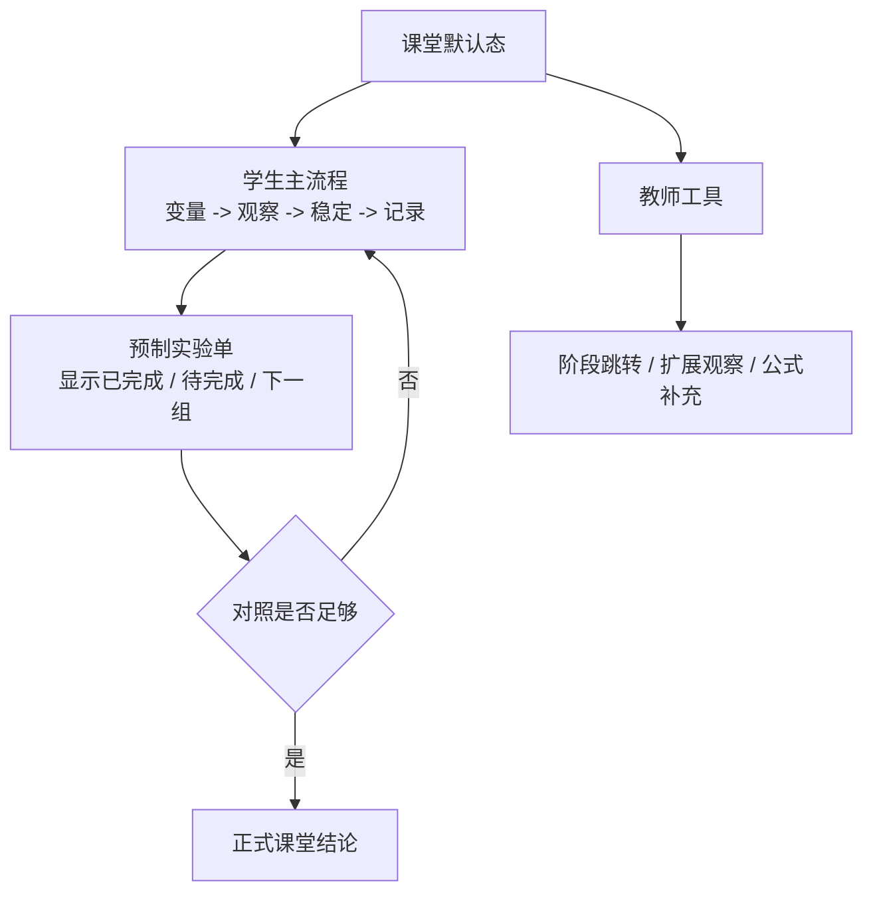

# refactor: Deepen sliding friction teaching flow

## Overview

在第二轮“课堂控制变量实验页”基础上，继续优化 `web-app` 的滑动摩擦力实验页，把默认体验从“老师可演示”推进到“学生也能顺着完成课堂探究”。

这轮不改技术栈、不改路由、不改 topic 兼容，不回到旧的多模式主导结构。重点是继续收紧教学顺序：延后公式揭示、限制学生跳阶段、让记录门槛更像真实实验、把记录区升级成更明确的课堂实验单。

## Problem Frame

当前 `web-app/app/components/basic-force-lab.tsx` 已经完成了课堂入口重排、显式记录和按因素分组记录，方向是对的，但整体仍保留了较强的软件操作感，而不是课堂实验感。

具体剩余问题是：

- 顶部步骤仍可直接跳阶段，学生可以绕过观察过程
- 公式与原理在默认界面中出现偏早，实验探究顺序还不够纯粹
- “稳定可记录”主要依赖预设实验阶段，读数稳定的观测感不强
- 记录区虽然已经按因素分组，但还不够像“待完成 / 已完成”的课堂实验单
- 2D 主舞台仍有较多并列信息表达，器材和读数的注意力中心不够强

这轮计划以 `docs/brainstorms/2026-07-24-sliding-friction-lab-teaching-pass-requirements.md` 为上游需求文档，以 `docs/plans/2026-07-24-002-refactor-sliding-friction-classroom-flow-plan.md` 为当前实现基线，继续围绕“学生探究优先”的目标做收敛。

## Requirements Trace

- R1-R3. 默认课堂入口继续收紧为学生安全链路，扩展能力下沉到教师工具。
- R4-R6. 原理与公式必须后置揭示，默认不抢占实验观察顺序。
- R7-R9. 记录资格与读数稳定表达要更接近真实课堂实验。
- R10-R12. 记录区升级为更像课堂实验单的结构，并支持下一组引导与分层结论。
- R13-R14. 2D 主舞台继续减负，重新强调器材、读数和当前任务。

## Scope Boundaries

- 不改动 `sliding-friction-lab` / `basic-force` 的 topic 与路由兼容关系。
- 不重做 `BasicForceThreeStage` 的 3D 架构，只继续收敛其默认入口权重。
- 不引入新的物理引擎、后端接口或数据同步逻辑。
- 不把当前页面扩展成通用实验平台或完整教师后台。

## Context & Research

### Relevant Code and Patterns

- `web-app/app/components/basic-force-lab.tsx`
  - 当前摩擦力实验主组件，承担课堂状态接线、2D/3D 舞台、控制面板与记录展示；本轮仍是主改动面
- `web-app/app/components/basic-force-lab-state.ts`
  - 已抽出课堂会话状态、研究因素基线、记录资格与分因素记录结构；适合作为本轮纯逻辑扩展基底
- `web-app/app/components/basic-force-record-table.tsx`
  - 当前按因素分组的记录表组件；本轮需要从“分组展示”升级到“预制实验单 + 引导”
- `web-app/app/components/control-panel-section.tsx`
- `web-app/app/components/control-chip-group.tsx`
- `web-app/app/components/control-button.tsx`
- `web-app/app/components/control-step-group.tsx`
  - 现有共享控件足够支撑“教师工具下沉”与“课堂主流程减负”，无需新建一套控件体系
- `web-app/app/components/basic-force-lab.test.tsx`
- `web-app/app/components/basic-force-lab-state.test.ts`
  - 当前已覆盖课堂默认态、研究因素切换、显式记录与失效逻辑；本轮应继续补教学门槛与信息揭示相关测试
- `web-app/app/app.css`
  - 当前同时承载通用实验控件样式和摩擦力业务样式；本轮仍沿用共享变量和视觉层规则

### Institutional Learnings

- `docs/solutions/`
  - 当前只有 `.gitkeep`，没有可复用的 institutional learnings
- `docs/brainstorms/2026-07-24-sliding-friction-lab-second-pass-review.md`
  - 定义了第二轮从“多模式演示页”收敛到“课堂控制变量实验页”的方向
- `docs/plans/2026-07-24-002-refactor-sliding-friction-classroom-flow-plan.md`
  - 当前已落地的课堂骨架来源；本轮不重复其已解决问题，只继续做教学化减负和顺序优化
- `docs/archive/可视化教学/物理实验可视化/力学_3_滑动摩擦力影响因素实验.docx`
  - 当前最硬的课堂事实来源：控制变量序列、匀速读数原则、课堂归纳顺序

### External References

- 无；当前仓库已有明确课堂来源文档和连续两轮本地需求/计划文档，本轮不需要额外外部研究

## Key Technical Decisions

- 决策 1：继续保持“单页 + 课堂会话状态 + 扩展观察层”的结构，不新增模式分支页面
  - 原因：第二轮已经把主结构拉回正轨，本轮目标是继续教学化，不是重新拆页面
- 决策 2：把“学生默认可见的课堂链路”与“教师快捷工具”分层，而不是物理删除快捷工具
  - 原因：老师演示时仍需要效率，但学生默认视角必须避免跳过实验过程
- 决策 3：新增纯逻辑教学派生层，负责稳定读数门槛、信息揭示时机、结论分层与下一组建议
  - 原因：这些规则既跨 UI，又不应继续堆在 `basic-force-lab.tsx` 内联分支里
- 决策 4：记录区升级为预制实验单时，优先高亮当前研究因素，但保留三类因素的整体完成度
  - 原因：这样既能告诉学生“现在先做什么”，又能保留完整课堂全局感
- 决策 5：公式后置采用“记录后可展开 / 完整对照后正式归纳”的双层策略
  - 原因：既避免首屏剧透，也不影响老师在需要时补充原理讲解

## Open Questions

### Resolved During Planning

- 顶部步骤条是否直接删除：否；默认保留为进度提示，但学生默认不可跳，跳阶段下沉到教师工具。
- 扩展模式是否继续保留：是；统一下沉到教师工具 / 扩展观察区，不再与课堂主操作并列。
- 记录区是只显示当前因素，还是同时显示三类因素：同时显示三类因素，但当前因素保持高亮，其余因素以较弱完成态展示。

### Deferred to Implementation

- “读数稳定”最终使用的时间窗长度、波动阈值和动画反馈阈值，需要结合现有 `timelineSeries` 和 `currentTimelineSample` 的离散度在执行时定标。
- 本轮是否顺手把 `MeasurementTeachingPanels` 和相关课堂 HUD 再拆分成单独子组件，还是先保留在 `basic-force-lab.tsx` 内，只在执行时按复杂度决定。

## High-Level Technical Design

> *This illustrates the intended approach and is directional guidance for review, not implementation specification. The implementing agent should treat it as context, not code to reproduce.*

### Teaching Surface Layering

| 层 | 默认面向对象 | 默认可见内容 | 下沉内容 |
|---|---|---|---|
| 课堂主流程层 | 学生 / 老师 | 当前研究因素、当前组条件、读数稳定提示、记录本组、预制实验单 | 阶段跳转、扩展模式、完整公式 |
| 教学解释层 | 老师为主 | 记录后可展开的“本组原理” | 首屏完整公式、完整结论 |
| 教师工具层 | 老师 | 步骤跳转、扩展观察、快捷复位 | 不再直接暴露给学生默认视角 |

## Implementation Units

- [ ] **Unit 1: 抽离教学派生层并补纯逻辑测试**

**Goal:** 为第三轮教学化优化建立纯逻辑教学派生层，承载稳定门槛、信息揭示、分层结论与下一组建议。

**Requirements:** R4-R12

**Dependencies:** None

**Files:**
- Create: `web-app/app/components/basic-force-lab-teaching.ts`
- Create: `web-app/app/components/basic-force-lab-teaching.test.ts`
- Modify: `web-app/app/components/basic-force-lab.tsx`
- Modify: `web-app/app/components/basic-force-lab-state.ts`

**Approach:**
- 保持 `basic-force-lab-state.ts` 只负责课堂会话与记录状态，不把“教学解释何时出现”继续塞进去
- 新增纯教学派生层，集中处理：
  - 读数稳定等级（建立中 / 趋稳 / 可记录）
  - 原理揭示门槛（未记录 / 已记录可展开 / 对照完成正式揭示）
  - 结论层级（无结论 / 趋势提示 / 正式结论）
  - 下一组建议与缺失组提示
- `basic-force-lab.tsx` 改为消费这些纯派生结果，而不是散落多处直接比较 `eligibility` 与记录数

**Execution note:** Start with failing pure tests for stability gating, conclusion levels, and next-group recommendation before rewiring UI.

**Patterns to follow:**
- `web-app/app/components/basic-force-lab-state.ts` 现有纯逻辑组织方式
- `web-app/app/components/basic-force-lab-state.test.ts` 当前课堂状态测试风格

**Test scenarios:**
- Happy path — 压力实验完成第一组后，派生结果显示“允许展开本组原理”但仍不给正式结论
- Happy path — 压力实验完成 2N / 4N / 6N 后，派生结果升级为正式课堂结论
- Happy path — 接触面积只完成 1 组时，只返回下一组建议与待测信息
- Edge case — 当前参数变化后，派生结果立即从“可记录”退回“需重新测量”
- Edge case — 扩展模式运行时，不生成课堂结论与下一组建议
- Integration — `basic-force-lab.tsx` 接线后，现有课堂记录与 eligibility 语义不被破坏

**Verification:**
- 教学时机与结论层级可由纯测试覆盖，UI 只负责消费结果而不重复发明规则

- [ ] **Unit 2: 收紧学生默认入口并下沉教师工具**

**Goal:** 把当前课堂操作区继续收紧为学生安全入口，同时保留教师快捷操作但不让其默认抢主线。

**Requirements:** R1-R3, R9

**Dependencies:** Unit 1

**Files:**
- Modify: `web-app/app/components/basic-force-lab.tsx`
- Modify: `web-app/app/app.css`
- Test: `web-app/app/components/basic-force-lab.test.tsx`

**Approach:**
- 默认课堂视图中，顶部步骤条改为只读进度表达或仅高亮当前阶段，不再直接响应学生点击跳阶段
- 把阶段跳转、扩展模式切换、教师讲解辅助入口统一收纳到“教师工具”或“扩展观察”区
- 左侧控制面板继续优先展示“当前研究因素、本组变量、当前能否记录、当前下一步”
- 保持课堂默认态仍为 `2D + measurement + panel expanded`

**Patterns to follow:**
- `web-app/app/components/control-panel-section.tsx` 的分区层级组织
- `web-app/app/components/control-step-group.tsx` 现有按钮禁用 / 激活表达

**Test scenarios:**
- Happy path — 打开实验页时，步骤条只提示当前阶段，学生默认不能点击跳到匀速阶段
- Happy path — 展开教师工具后，仍可以执行阶段跳转与扩展模式切换
- Edge case — 从教师工具切回课堂主流程时，当前研究因素、已记录数据与主舞台状态保持一致
- Edge case — 学生默认视角下，扩展模式按钮不再与“开始实验 / 记录本组”并列
- Integration — 全屏、亮暗主题和控制面板折叠后，教师工具层级仍清晰可辨

**Verification:**
- 学生默认入口不再鼓励跳过程，教师仍可在二级区域找到快捷操作

- [ ] **Unit 3: 重排 2D 主舞台信息层级并后置公式揭示**

**Goal:** 让 2D 主舞台回到“器材 + 读数 + 当前任务”中心，同时把原理与公式挪到更合适的揭示时机。

**Requirements:** R4-R9, R13-R14

**Dependencies:** Unit 1, Unit 2

**Files:**
- Modify: `web-app/app/components/basic-force-lab.tsx`
- Create: `web-app/app/components/basic-force-classroom-summary.tsx`
- Modify: `web-app/app/app.css`
- Test: `web-app/app/components/basic-force-lab.test.tsx`

**Approach:**
- 将当前 `MeasurementTeachingPanels` 里的课堂提示、原理说明、读数提示继续拆层：
  - 默认只保留当前组条件、读数状态、记录提示
  - 记录后才允许展开更完整的“本组原理”
  - 完整对照后才展示正式归纳卡
- 舞台顶部和内联 HUD 继续减负，弱化重复的状态条、进度条与装饰性说明
- 新建轻量课堂 summary 子组件，减少 `basic-force-lab.tsx` 对舞台说明文案与记录提示的耦合

**Patterns to follow:**
- `web-app/app/components/motion-track-lab.tsx` 的紧凑 summary bar 间距控制
- `web-app/app/components/basic-force-record-table.tsx` 当前“少容器、强层次”的信息组织方向

**Test scenarios:**
- Happy path — 首屏默认只显示当前任务提示，不直接渲染完整公式推导
- Happy path — 完成第一组记录后，页面出现可展开的“本组原理”入口
- Happy path — 完成完整压力对照后，正式结论区域才进入可见状态
- Edge case — 重新修改参数后，原理与结论显示回退到待观察状态
- Integration — 2D 主舞台在不同尺寸下不出现说明块与器材互相遮挡

**Verification:**
- 2D 主舞台的第一视觉层变成器材和读数，原理解释退到更合适的时机与位置

- [ ] **Unit 4: 把分组记录区升级为预制课堂实验单**

**Goal:** 让当前按因素分组记录区升级成更明确的课堂实验单，显示待测组、下一组建议与分层结论。

**Requirements:** R10-R12

**Dependencies:** Unit 1

**Files:**
- Modify: `web-app/app/components/basic-force-record-table.tsx`
- Modify: `web-app/app/components/basic-force-lab.tsx`
- Modify: `web-app/app/app.css`
- Test: `web-app/app/components/basic-force-lab.test.tsx`
- Test: `web-app/app/components/basic-force-lab-teaching.test.ts`

**Approach:**
- 当前三类因素的记录区从“只有已记录行”改成“完整实验单 + 已完成 / 待测状态”
- 当前研究因素组保持高亮，其余因素组展示较弱完成态和完成度
- 在当前组记录后明确显示：
  - 下一组建议（如压力从 4N 到 6N）
  - 当前因素还缺哪几组
  - 目前是“无结论 / 初步趋势 / 正式结论”的哪一层
- 保持课堂记录与扩展模式隔离，不让扩展模式结果混入实验单

**Patterns to follow:**
- `web-app/app/components/basic-force-record-table.tsx` 当前分组卡片结构
- `web-app/app/components/basic-force-lab.tsx` 现有课堂记录高亮逻辑

**Test scenarios:**
- Happy path — 压力实验未开始时，实验单显示 2N / 4N / 6N 三行待测状态
- Happy path — 记录 4N 后，实验单高亮当前行并给出“下一组建议”
- Happy path — 压力三组完成后，实验单显示正式课堂结论
- Edge case — 只完成 1 组时，实验单只显示趋势引导，不显示正式结论
- Edge case — 改切到材质研究因素后，压力组保留已完成记录，材质组切为当前高亮组
- Integration — 清空记录后，三类因素实验单全部回到待测状态

**Verification:**
- 学生能直接从记录区看出“现在做到了哪一组、下一组该做什么、当前能否归纳结论”

## System-Wide Impact

- **Interaction graph:** 影响 `BasicForceLab` 的课堂主流程、`basic-force-lab-state.ts` 的 eligibility 消费方式、`basic-force-record-table.tsx` 的记录展示语义，以及 `ControlStepGroup` 在课堂模式中的交互角色
- **Error propagation:** 若稳定判定阈值过严或过松，会直接影响可记录门槛与课堂结论层级，虽然视觉展示仍可能看起来正常
- **State lifecycle risks:** 公式后置、趋势结论和下一组建议一旦与 `recordsByFactor` 同步不一致，会导致“界面提示”和“实验单内容”脱节
- **API surface parity:** `sliding-friction-lab` 与 `basic-force` 的入口、全屏壳层、亮暗主题和扩展模式兼容关系保持不变
- **Integration coverage:** 重点验证“学生默认不可跳阶段”“修改参数使当前读数失效”“记录后才揭示原理”“完整组数后才给正式结论”“清空记录后实验单重置”
- **Unchanged invariants:** 2D/3D 共用物理量派生链、课堂记录按因素分组、扩展模式与课堂记录隔离这些第二轮已经建立的边界不应被本轮回退

## Risks & Dependencies

| Risk | Mitigation |
|------|------------|
| 过度弱化教师快捷操作，影响老师演示效率 | 将快捷能力下沉到教师工具，而不是物理删除 |
| 稳定判定阈值设置不当，导致“太难记录”或“过早可记” | 先把稳定判定抽成纯逻辑并补测试，执行期通过现有样本数据做小范围标定 |
| 主舞台减负过程中，信息隐藏过深导致用户迷路 | 保留“当前研究因素 / 当前组条件 / 当前下一步”三条最小课堂主线 |
| 继续在 `basic-force-lab.tsx` 内堆逻辑导致维护压力回升 | 优先把教学派生层和课堂 summary 抽出为独立纯逻辑 / 子组件 |

## Documentation / Operational Notes

- `web-app` 仍是纯静态构建模块；本轮不涉及部署脚本、后端环境变量或桌面端同步。
- 实现完成后，应补一份 `docs/solutions/` 文档，总结“为什么课堂实验页不能让播放器心智重新上位”这条 institutional learning。

## Sources & References

- **Origin document:** `docs/brainstorms/2026-07-24-sliding-friction-lab-teaching-pass-requirements.md`
- Related brainstorm: `docs/brainstorms/2026-07-24-sliding-friction-lab-second-pass-review.md`
- Related plan: `docs/plans/2026-07-24-002-refactor-sliding-friction-classroom-flow-plan.md`
- Related code: `web-app/app/components/basic-force-lab.tsx`
- Related code: `web-app/app/components/basic-force-lab-state.ts`
- Related code: `web-app/app/components/basic-force-record-table.tsx`
- Classroom source: `docs/archive/可视化教学/物理实验可视化/力学_3_滑动摩擦力影响因素实验.docx`
