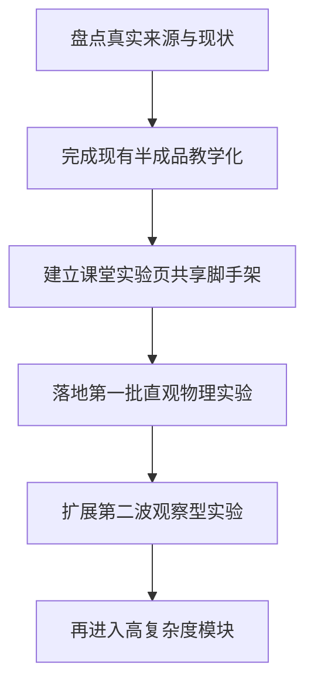

# feat: Prioritize remaining teaching modules for classroom-first rollout

## Overview

从“更容易教学”的视角重新审视当前 backlog，先把真正适合课堂首批落地、且最容易讲清楚的模块排到前面，再明确哪些只是在目录里占位、哪些已经有实验原文但还没真正进入页面实现。目标不是继续平均铺开，而是先形成一条稳定的“课堂实验页生产线”。

## Problem Frame

当前仓库的内容分成四层，但这四层还没有统一成一条明确的教学开发路线：

| 层级 | 当前状态 | 代表内容 | 问题 |
|---|---|---|---|
| 已有沉浸式实验页 | 已有真实组件 | `motion-track`、`sliding-friction-lab`、`circuit-observer` | 只有前两个更接近课堂主流程，电路页仍偏“示意观察页” |
| 目录已建但未真实实现 | 仍走默认占位壳 | `force-analysis`、`projectile-motion`、`function-lab` 等 | 用户能点进去，但不是可教学页面 |
| 归档已有 Word 原始实验 | 尚未进目录或未接线 | `力学_1/2/4/5`、`光学_1~5`、`热学_4/5`、`电学_2/3` | 有高价值原始资料，但没有转成产品排期 |
| 非当前主线占位主题 | 可后续扩展 | 数学 / 化学 / 记忆专题及部分高中主题 | 现在就做会分散课堂实验页的方法论沉淀 |

从“容易教学”出发，当前最核心的问题不是“还有多少 topic 没做”，而是：

1. **当前优先级没有按课堂易懂度排序**
2. **归档 Word 与实际 catalog 没有建立稳定映射**
3. **已有实验页没有沉淀出统一的教学页脚手架**

如果继续直接挑新题做，页面会越来越多，但教学体验会越来越不一致。

## Requirements Trace

- R1. 必须先明确“哪些知识点值得先做”，排序依据要同时考虑教学易懂度、可视化收益、实现复用度。
- R2. 必须区分“已有真实实验页”“目录占位页”“Word 归档未接入页”，避免目录看起来很多、实际可教内容很少。
- R3. 下一阶段应优先完成现有半成品实验页，而不是继续新增更多默认占位壳页面。
- R4. 第一批新增页面应优先选择现象直观、控制变量清晰、2D 即可讲清的实验。
- R5. 高复杂度主题应明确后置条件，避免过早进入需要复杂光学、介质、浮力或多图表联动的模块。
- R6. 计划应明确后续实际会改哪些文件、补哪些组件、建立哪些可复用教学脚手架。

## Scope Boundaries

- 本计划优先覆盖 `docs/archive/可视化教学/物理实验可视化/` 中的物理实验原始资料，以及 `web-app` 当前已接线或已占位的相关页面。
- 本计划不在这一轮展开数学、化学、记忆专题的详细实现设计，只给出后置原则。
- 本计划不直接实现代码，只定义后续课堂优先开发顺序与实现分组。
- 本计划不把“高中抽象专题”放在当前首批主线前面，除非已有初中实验页脚手架可复用成熟。

## Context & Research

### Relevant Code and Patterns

- `web-app/app/routes/visualization.tsx`：当前只有 `sliding-friction-lab`、`motion-track`、`circuit-observer` 走真实实验页，其余 topic 仍回退到默认占位壳。
- `web-app/app/data/teaching-catalog.ts`：目录已存在多个 topic，但其中相当一部分还没有对应真实组件。
- `web-app/app/components/motion-track-lab.tsx`：已形成较完整的“控制面板 + 2D/3D 可视化 + 图表”结构。
- `web-app/app/components/basic-force-lab.tsx`：已形成更强的“课堂主流程 + 实验单 + 分层结论”结构，是当前最像课堂实验页的模板。
- `web-app/app/components/circuit-observer-lab.tsx`：已有电路可视化基础，但尚未升级到课堂探究页层级。

### Institutional Learnings

- `docs/solutions/2026-07-24-sliding-friction-classroom-layering.md` 已验证：教学页应优先保护 `选变量 -> 观察 -> 稳定 -> 记录 -> 对照 -> 归纳` 链路，而不是先堆功能。

### Source Archive Review

对归档 Word 首轮盘点后，按“课堂易懂度 / 现象可视性 / 当前脚手架复用度”可以分成四档：

| 优先级 | 主题 | 教学价值判断 |
|---|---|---|
| A. 先补齐现有半成品 | 串并联电路电流电压规律 | 已有组件，学生最容易直观看亮灭、通断、串并差异，补教学流程收益最高 |
| B. 最适合下一批落地 | 压强影响因素、牛顿第一定律、二力平衡 | 现象直观、控制变量清楚、2D 足够、能复用现有力学脚手架 |
| C. 第二波观察型模块 | 光的反射、平面镜成像、液体蒸发快慢、欧姆定律 | 课堂价值高，但需要新的器材表达和更细的对照提示 |
| D. 高复杂度后置 | 凸透镜、光的折射、浮力与阿基米德、晶体与非晶体、滑动变阻器 | 需要更复杂状态、图表、介质/曲线/结构表达，不宜抢在前面 |

### External References

- 无。当前阶段以本仓库中的原始 Word 资料和现有页面模式为主要依据即可。

## Key Technical Decisions

- **以 archive-backed 初中物理为下一阶段主线**：优先把归档 Word 中最适合教学的实验转成页面，而不是继续扩张抽象 placeholder topic。
- **先补半成品，再开新题**：`circuit-observer` 先教学化，完成后再进入下一批新实验。
- **先做“现象直观 + 2D 足够”的实验**：压强、惯性、二力平衡这类内容更适合作为脚手架复用训练场。
- **把 catalog 与真实实现分层表达**：目录中必须能区分“可直接教学”“仅有规划”“占位待建”，避免误导。
- **高复杂度实验后置**：需要精细光学、介质切换、浮沉条件、连续曲线平台的模块，不抢第一波。
- **高中抽象专题暂缓**：在初中实验页的课堂脚手架稳定前，不优先推进 `force-analysis`、`projectile-motion` 一类更偏专题演示的页面。

## Open Questions

### Resolved During Planning

- 当前是否应该把 math / chemistry / memory 一并推进？否。本轮先聚焦物理实验主线，先形成一套稳定方法论。
- 当前是否应该继续新增更多 catalog 占位 topic？否。先把 source-backed backlog 和现有半成品做实。
- 下一步最值得继续完善的现有页面是否是 `circuit-observer`？是。它已接线、有明显课堂价值，而且补齐成本最低。

### Deferred to Implementation

- `teaching-catalog.ts` 中具体要不要新增完整 archive topic 列表，还是先只补第一批将要实现的主题，留到执行时根据首页信息密度再定。
- `motion-track` 是否也需要再做一轮课堂化复盘，目前先视为“可用基线”，执行时若发现与新脚手架差异过大，再补统一。
- 第一批新实验的 slug 命名是否全部按 archive 原名映射，还是先采用产品化短名，留到执行时统一决定。

## High-Level Technical Design

> *This illustrates the intended approach and is directional guidance for review, not implementation specification. The implementing agent should treat it as context, not code to reproduce.*

## Success Metrics

- 目录里不再混淆“真实实验页”和“默认占位壳”。
- 下一阶段至少形成 4~6 个真正可课堂使用的初中物理实验页，而不只是卡片入口。
- 新增实验页都能复用统一的课堂结构：控制变量、观察提示、记录单、对照结论。
- 高复杂度模块在进入实现前，已经有明确的后置条件和共享脚手架基础。

## Implementation Units

- [ ] **Unit 1: 统一 backlog 分层与目录语义**

**Goal:** 让 catalog、内容入口和可视化路由能清楚反映“真实实验页 / 规划中 / 占位”三类状态。

**Requirements:** R1, R2, R6

**Dependencies:** None

**Files:**
- Modify: `web-app/app/data/teaching-catalog.ts`
- Modify: `web-app/app/routes/content-subject.tsx`
- Modify: `web-app/app/routes/visualization.tsx`
- Test: `web-app/app/routes/content-subject.test.tsx`
- Test: `web-app/app/routes/visualization.test.tsx`

**Approach:**
- 先按当前真实实现、archive-backed backlog、纯占位 topic 三类重标 status / 文案；
- 避免用户点进默认壳还误以为是已完成实验页；
- 为后续第一批 archive-backed 主题预留清晰的接线位置。

**Patterns to follow:**
- `web-app/app/routes/visualization.tsx` 中当前 immersive vs default shell 分流方式
- `web-app/app/data/teaching-catalog.ts` 中现有 topic metadata 结构

**Test scenarios:**
- Happy path — 已实现的实验页仍路由到真实组件。
- Happy path — 未实现 topic 在内容入口与可视化页上显示为明确的“规划中 / 未完成”语义，而不是冒充真实实验页。
- Edge case — 旧 alias（如 `basic-force`）仍能正确映射到现有真实页面。

**Verification:**
- 用户从目录进入时，能一眼分辨哪些能直接教学、哪些还只是计划项。

- [ ] **Unit 2: 把 `circuit-observer` 升级成课堂实验页基线**

**Goal:** 把电路页从“可观察示意图”升级成“能按课堂顺序完成一轮串并联规律讲解”的页面。

**Requirements:** R3, R4, R6

**Dependencies:** Unit 1

**Files:**
- Modify: `web-app/app/components/circuit-observer-lab.tsx`
- Modify: `web-app/app/app.css`
- Create: `web-app/app/components/circuit-observer-teaching.ts`
- Test: `web-app/app/components/circuit-observer-lab.test.tsx`

**Approach:**
- 参考 `basic-force-lab.tsx` 的课堂主流程，把“拓扑选择 -> 观察亮灭/通路 -> 读数对照 -> 归纳规律”做成清晰主链；
- 把电流 / 电压 / 故障模式继续保留，但下沉成辅助观察；
- 新增实验单或对照区，支持“串联电流处处相等 / 并联电压处处相等”等课堂归纳。

**Patterns to follow:**
- `web-app/app/components/basic-force-lab.tsx`
- `web-app/app/components/basic-force-record-table.tsx`
- `web-app/app/components/control-panel-section.tsx`

**Test scenarios:**
- Happy path — 默认进入后能先选择串联 / 并联，再按提示完成一轮观察。
- Happy path — 开关、灯泡断开、支路变化后，主舞台与记录区同步更新。
- Edge case — 切到辅助观察模式后，不破坏主流程记录状态。
- Integration — 串联与并联切换时，课堂结论、对照区与路由状态一致更新。

**Verification:**
- 电路页达到与摩擦力页同级别的课堂可讲解程度，而不再只是电路示意展示。

- [ ] **Unit 3: 建立第一批“直观力学实验”实现波次**

**Goal:** 优先落地最容易教学、且能复用现有力学脚手架的新实验页。

**Requirements:** R1, R4, R6

**Dependencies:** Unit 2

**Files:**
- Create: `web-app/app/components/pressure-factors-lab.tsx`
- Create: `web-app/app/components/newton-first-law-lab.tsx`
- Create: `web-app/app/components/two-force-balance-lab.tsx`
- Modify: `web-app/app/routes/visualization.tsx`
- Modify: `web-app/app/data/teaching-catalog.ts`
- Modify: `web-app/app/app.css`
- Test: `web-app/app/components/pressure-factors-lab.test.tsx`
- Test: `web-app/app/components/newton-first-law-lab.test.tsx`
- Test: `web-app/app/components/two-force-balance-lab.test.tsx`

**Approach:**
- `压强影响因素` 优先复用摩擦力页的“控制变量 + 记录单 + 对照结论”结构；
- `牛顿第一定律` 优先复用运动学页的小车、轨迹、不同阻力面的对照思路；
- `二力平衡` 优先复用受力箭头、对称对照和条件验证流程；
- 三者都保持 2D 优先，不追求 3D 先行。

**Patterns to follow:**
- `web-app/app/components/basic-force-lab.tsx`
- `web-app/app/components/motion-track-lab.tsx`
- `web-app/app/components/visual-mode-switch.tsx`（仅在确有必要时复用）

**Test scenarios:**
- Happy path — 每个实验页首次进入后都能在 5~10 秒内看懂“当前变量、下一步操作、何时记录”。
- Happy path — 完成一组到多组对照后，记录区和课堂结论能分层变化。
- Edge case — 改变变量后，旧读数失效并要求重新观察。
- Integration — 三个新实验页都能从目录进入，并走真实实验组件而不是默认壳。

**Verification:**
- 第一批新增真实实验页形成统一方法论，证明课堂脚手架可跨题复用。

- [ ] **Unit 4: 建立第二波“观察型实验”模块组**

**Goal:** 在第一批力学脚手架稳定后，扩展到更偏现象观察与对照归纳的主题。

**Requirements:** R4, R5, R6

**Dependencies:** Unit 3

**Files:**
- Create: `web-app/app/components/light-reflection-lab.tsx`
- Create: `web-app/app/components/plane-mirror-lab.tsx`
- Create: `web-app/app/components/evaporation-rate-lab.tsx`
- Create: `web-app/app/components/ohms-law-lab.tsx`
- Modify: `web-app/app/routes/visualization.tsx`
- Modify: `web-app/app/data/teaching-catalog.ts`
- Modify: `web-app/app/app.css`
- Test: `web-app/app/components/light-reflection-lab.test.tsx`
- Test: `web-app/app/components/plane-mirror-lab.test.tsx`
- Test: `web-app/app/components/evaporation-rate-lab.test.tsx`
- Test: `web-app/app/components/ohms-law-lab.test.tsx`

**Approach:**
- `光的反射` 和 `平面镜成像` 先做角度 / 对称关系的可视对照，不急着上复杂光线物理引擎；
- `液体蒸发` 以控制变量与现象变化为核心，重在课堂推理顺序；
- `欧姆定律` 先做控制变量实验单和图表关系，不急着引入复杂电路编辑器。

**Patterns to follow:**
- `web-app/app/components/circuit-observer-lab.tsx`
- `web-app/app/components/basic-force-comparison-chart.tsx`
- `web-app/app/components/control-range.tsx`

**Test scenarios:**
- Happy path — 每个页面都能表达一条明确的课堂主链，不会退回纯演示页。
- Edge case — 当控制变量被破坏时，页面明确阻止错误归纳。
- Integration — 观察型模块新增后，目录、内容页、可视化路由与状态文案同步更新。

**Verification:**
- 第二波页面覆盖更多学科现象，但仍沿用统一课堂方法，不出现风格和流程断层。

- [ ] **Unit 5: 为高复杂度模块建立后置门槛与预研边界**

**Goal:** 明确哪些主题暂不进入实现，以及进入前必须满足的共享条件。

**Requirements:** R5, R6

**Dependencies:** Unit 4

**Files:**
- Modify: `web-app/app/data/teaching-catalog.ts`
- Create: `docs/brainstorms/2026-07-24-high-complexity-physics-labs-requirements.md`
- Create: `docs/plans/2026-07-24-006-feat-high-complexity-physics-labs-plan.md`

**Approach:**
- 把 `凸透镜`、`光的折射`、`浮力与阿基米德`、`晶体与非晶体`、`滑动变阻器` 标记为高复杂度队列；
- 给出进入实现前的必要条件：共享图表层、介质/状态层、连续曲线表达、测量流程脚手架是否成熟；
- 避免在第一波脚手架尚未稳定时，直接切入这些复杂题。

**Patterns to follow:**
- `docs/plans/2026-07-24-004-feat-sliding-friction-word-alignment-plan.md`
- `docs/brainstorms/2026-07-24-sliding-friction-lab-alignment-requirements.md`

**Test scenarios:**
- Test expectation: none -- 本单元以计划边界和 backlog 管理为主，不直接引入运行时行为。

**Verification:**
- 高复杂度模块从“模糊 backlog”变成“有明确前置条件的下一阶段队列”。

## Phased Delivery

### Phase 1
- 目录与状态语义收口
- `circuit-observer` 教学化完成

### Phase 2
- 第一批直观力学实验：压强、惯性、二力平衡

### Phase 3
- 第二波观察型实验：反射、平面镜、蒸发、欧姆定律

### Phase 4
- 高复杂度实验预研与进入条件确认

## System-Wide Impact

- **Interaction graph:** 影响 `teaching-catalog`、内容页列表、可视化路由分发，以及多个新的实验组件接线方式。
- **Error propagation:** 如果不先做目录分层，用户会继续从入口层误判未完成主题为可用主题。
- **State lifecycle risks:** 多实验页并行增长后，若没有共享脚手架，状态管理、记录单与课堂结论会迅速碎片化。
- **API surface parity:** 新增实验页应尽量沿用现有 `TeachingTopic`、全屏、控制面板、主题与多语言接入方式。
- **Integration coverage:** 至少需要覆盖目录入口 -> 内容页 -> 可视化路由 -> 实验页真实组件这一整条链路。
- **Unchanged invariants:** 当前 `motion-track` 与 `sliding-friction-lab` 的沉浸式页面入口方式不变；`circuit-observer` 继续沿用现有 topic id。

## Risks & Dependencies

| Risk | Mitigation |
|------|------------|
| 继续扩张 placeholder topic 导致目录越来越“虚” | 先做 Unit 1，把状态语义收紧 |
| 新实验页各做各的，课堂结构再次分裂 | 先完成 `circuit-observer` 教学化，再批量复用脚手架 |
| 过早进入光学/浮力等高复杂度题导致节奏失控 | 明确后置门槛，把复杂题放到独立预研队列 |
| backlog 过多导致执行失焦 | 采用 Phase 1~4 波次推进，每波只处理一类问题 |

## Documentation / Operational Notes

- 后续每完成一个 archive-backed 实验页，建议同步补一篇 `docs/solutions/`，记录该实验页复用了哪些课堂脚手架。
- 当第一批和第二批实验页完成后，应再回头评估 `motion-track` 是否要做统一教学化重构。

## Sources & References

- `docs/archive/可视化教学/README.md`
- `docs/archive/可视化教学/物理实验可视化/力学_1_牛顿第一定律实验.docx`
- `docs/archive/可视化教学/物理实验可视化/力学_2_二力平衡条件探究.docx`
- `docs/archive/可视化教学/物理实验可视化/力学_4_压强影响因素实验.docx`
- `docs/archive/可视化教学/物理实验可视化/电学_1_串并联电路电流电压规律.docx`
- `docs/archive/可视化教学/物理实验可视化/电学_2_欧姆定律探究实验.docx`
- Related code: `web-app/app/routes/visualization.tsx`
- Related code: `web-app/app/data/teaching-catalog.ts`
- Related code: `web-app/app/components/basic-force-lab.tsx`
- Related code: `web-app/app/components/circuit-observer-lab.tsx`
- Related code: `web-app/app/components/motion-track-lab.tsx`
- Institutional learning: `docs/solutions/2026-07-24-sliding-friction-classroom-layering.md`
