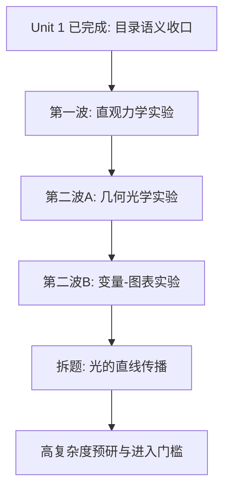

# feat: Prioritize remaining teaching modules for classroom-first rollout

## Overview

在 `web-app` 已经完成目录状态分层（Unit 1），且用户最新判断 `circuit-observer` “目前还可以”的前提下，这份路线计划需要从“先补电路页，再考虑其他”升级为“把剩余 Word 归档实验拆成可直接执行的波次”。目标不是继续笼统地说“后面做力学 / 光学 / 电学”，而是把剩余 archive-backed 主题排成明确的开发梯队、拆题梯队和高复杂度后置梯队。

## Problem Frame

当前仓库的教学内容已经不再是“完全从零”，而是进入了“已有基线页面，但剩余 backlog 还太粗”的阶段：

| 层级 | 当前状态 | 代表内容 | 当前真正的问题 |
|---|---|---|---|
| 已有真实实验页 | 已有可进入页面 | `motion-track`、`sliding-friction-lab`、`circuit-observer` | 已形成基线，但还没带动后续 archive-backed 主题持续落地 |
| 目录已建但未真实实现 | 目录语义已收口 | `force-analysis`、`projectile-motion`、`function-lab` 等 | 入口不会再误导，但这些主题仍不是近期课堂主线 |
| Word 归档已存在但未分波次 | 资料完整 | `力学_1/2/4/5`、`光学_1~5`、`热学_4/5`、`电学_2/3` | 还缺“哪个先做、哪个拆题、哪个后置”的精细排序 |
| 复合主题与高复杂度主题 | 不能直接开做 | `光学_2_光的直线传播`、`光学_1`、`光学_4`、`力学_5`、`电学_3` 等 | 要么一个文档塞了多个现象，要么依赖更复杂的状态/图表/介质表达 |

从“容易教学”出发，当前最核心的问题变成：

1. **剩余 archive 主题还只有粗粒度优先级，没有形成真正的开发波次**
2. **个别 Word 文档天然是复合题，直接做会让页面范围失控**
3. **现有基线页面已经够用，下一步更该扩张稳定生产线，而不是继续只打磨单页**

## Requirements Trace

- R1. 必须先明确“哪些知识点值得先做”，排序依据要同时考虑教学易懂度、可视化收益、实现复用度。
- R2. 必须区分“已有真实实验页”“目录占位页”“Word 归档未接入页”，避免目录看起来很多、实际可教内容很少。
- R3. 下一阶段应优先推进最容易课堂化的 archive-backed 实验页；现有页面只要已达到可讲解基线，就不再强行抢占优先级。
- R4. 第一批新增页面应优先选择现象直观、控制变量清晰、2D 即可讲清的实验。
- R5. 高复杂度主题应明确后置条件，避免过早进入需要复杂光学、介质、浮力或多图表联动的模块。
- R6. 计划应明确后续实际会改哪些文件、补哪些组件、建立哪些可复用教学脚手架。
- R7. 剩余 Word 归档需要建立更细的“立即开发 / 先拆题 / 高复杂度后置”规则，而不是只保留大类判断。

## Scope Boundaries

- 本计划继续聚焦 `docs/archive/可视化教学/物理实验可视化/` 中的初中物理实验原始资料，以及 `web-app` 当前对应的页面接线方式。
- 本计划不在这一轮展开数学、化学、记忆专题的详细实现设计，只给出继续后置的原则。
- 本计划不直接实现代码，只定义剩余 archive-backed 物理实验的精细波次与接线路线。
- `circuit-observer` 在本轮不再作为主阻塞项；若后续电学组件抽象需要回补，再作为并行优化处理。
- `光学_2_光的直线传播` 本轮只规划拆题策略，不直接按原 Word 的完整范围一次性落页面。

## Context & Research

### Relevant Code and Patterns

- `web-app/app/routes/visualization.tsx`：经过 Unit 1 后，已实现 topic 与规划中 topic 的路由语义已经分层清楚，可继续承接新实验页接线。
- `web-app/app/data/teaching-catalog.ts`：已具备 `deliveryState` 区分，可继续承接第一波与第二波 archive-backed 主题。
- `web-app/app/components/basic-force-lab.tsx`：当前最成熟的“课堂主流程 + 实验单 + 分层结论”模板。
- `web-app/app/components/motion-track-lab.tsx`：适合复用到带轨迹、时间推进、图表联动的实验页。
- `web-app/app/components/circuit-observer-lab.tsx`：当前已达到可接受基线，更适合作为后续电学页面的图元和状态表达参考，而不是近期唯一主阻塞页。

### Institutional Learnings

- `docs/solutions/2026-07-24-sliding-friction-classroom-layering.md` 已验证：教学页首先要保护 `选变量 -> 观察 -> 稳定 -> 记录 -> 对照 -> 归纳` 这条链路，不能重新退回“播放器心智”。

### Source Archive Review

基于 Word 内容抽样而不是只看文件名，剩余 archive-backed 主题已经可以更细地分成五层：

| 层级 | 主题 | 规划判断 |
|---|---|---|
| A. 第一波立即开发 | 压强影响因素、牛顿第一定律、二力平衡 | 现象直观、控制变量清晰，且能直接复用现有力学脚手架 |
| B. 第二波几何光学 | 光的反射、平面镜成像 | 都是强 2D 场景，核心是角度 / 对称关系，适合在力学波次稳定后进入 |
| C. 第二波变量-图表实验 | 液体蒸发快慢、欧姆定律 | 仍然适合教学，但更依赖时间推进、图表、控制变量记录单 |
| D. 先拆题再决定是否进入实现 | 光的直线传播 | 一个 Word 同时包含小孔成像、影子、日食月食、散射演示，直接实现范围过大 |
| E. 高复杂度后置 | 凸透镜、光的折射、浮力与阿基米德、晶体与非晶体、滑动变阻器 | 需要更复杂的介质、曲线、排液、状态切换或电路器材表达 |

### Remaining Archive Delivery Matrix

| 原始文档 | 建议产品主题 | 教学价值判断 | 当前处理结论 |
|---|---|---|---|
| `力学_4_压强影响因素实验.docx` | `pressure-factors-lab` | 海绵形变、压力/面积双因素、`P=F/S` 很适合课堂首批 | 第一波立即开发 |
| `力学_1_牛顿第一定律实验.docx` | `newton-first-law-lab` | 同速释放、不同阻力面、理想光滑外推，直观且可复用小车轨道 | 第一波立即开发 |
| `力学_2_二力平衡条件探究.docx` | `two-force-balance-lab` | 四条件可逐条验证，适合做“条件破坏 -> 观察状态变化” | 第一波立即开发 |
| `光学_3_光的反射定律.docx` | `light-reflection-lab` | 拖角度、法线、反射角，纯 2D 就能讲清 | 第二波几何光学 |
| `光学_5_平面镜成像.docx` | `plane-mirror-lab` | 对称、虚像、物距像距相等，2D 场景足够直观 | 第二波几何光学 |
| `热学_5_液体蒸发快慢影响因素.docx` | `evaporation-rate-lab` | 控制变量逻辑强，但更依赖时间推进和数据曲线 | 第二波变量-图表实验 |
| `电学_2_欧姆定律探究实验.docx` | `ohms-law-lab` | I-U / I-R 图像课堂价值高，但图表与定值控制更重 | 第二波变量-图表实验 |
| `光学_2_光的直线传播.docx` | `shadow-and-pinhole-lab` / `light-propagation-lab`（待拆题） | 原始资料过宽，混合了影子、小孔成像、天文现象与散射展示 | 先拆题，再决定进入哪一波 |
| `力学_5_浮力与阿基米德原理.docx` | `buoyancy-lab` | 教学价值高，但排液、液体密度、浮沉状态联动更复杂 | 高复杂度后置 |
| `光学_1_凸透镜成像规律.docx` | `lens-imaging-lab` | 涉及多种成像工况与实像/虚像切换 | 高复杂度后置 |
| `光学_4_光的折射规律.docx` | `light-refraction-lab` | 涉及双介质、折射角与介质切换 | 高复杂度后置 |
| `热学_4_晶体与非晶体熔化凝固实验.docx` | `melting-freezing-lab` | 需要温度-时间曲线与平台解释，图表表达要求更高 | 高复杂度后置 |
| `电学_3_滑动变阻器动态调压实验.docx` | `variable-resistor-lab` | 需要更复杂的电路安全态、分压逻辑与器材表达 | 高复杂度后置 |

### External References

- 无。当前阶段以本仓库中的 Word 资料、现有页面模式和已沉淀的课堂化经验为主要依据即可。

## Key Technical Decisions

- **把 `circuit-observer` 从“必先补完”降为“当前可接受基线”**：根据用户最新反馈，它暂时不再是主阻塞项。只有当后续欧姆定律或电学共用组件需要抽象时，再回头补局部教学化。
- **第一波明确只做三类直观力学实验**：`压强影响因素`、`牛顿第一定律`、`二力平衡` 组成新的共享脚手架训练场。
- **把第二波拆成两个子波次，而不是混成一个“大观察型模块”**：几何光学（反射、平面镜）与变量-图表实验（蒸发、欧姆定律）对页面结构的要求不同，混做会破坏复用判断。
- **`光的直线传播` 先拆题，不直接一页吃掉**：至少拆成“影子 / 小孔成像”与“天文遮挡 / 散射演示”两个层级，避免 scope 爆炸。
- **高复杂度模块继续后置，但从现在开始要给出进入门槛**：后置不是“无限期以后再说”，而是明确依赖哪些共享能力成熟后再进场。
- **高中抽象专题继续后置**：在初中物理课堂生产线没有稳定前，不优先推进 `force-analysis`、`projectile-motion` 一类专题演示页。

## Open Questions

### Resolved During Planning

- 当前是否还要把 `circuit-observer` 继续放在下一步最高优先级？**否。** 用户最新反馈是“目前还可以”，所以它保留为可接受基线，不再阻塞新实验页波次。
- 第二波是否继续把所有观察型主题混做？**否。** 现已拆成“几何光学”和“变量-图表实验”两个子波次。
- `光学_2_光的直线传播` 是否直接进入开发？**否。** 原文档范围过大，必须先做产品拆题。

### Deferred to Implementation

- `光的直线传播` 拆题后优先先落“影子形成”还是“小孔成像”，留到拆题文档阶段再定。
- `晶体与非晶体熔化凝固` 是否能在图表脚手架成熟后从高复杂度队列下调，留到第二波图表类页面完成后再评估。
- 后续若为 `ohms-law-lab` 抽出共用电学器材组件，是否回补到 `circuit-observer`，留到真正出现复用价值时再决定。
- 第一波与第二波主题的最终 slug 是否完全按 archive 原名映射，还是转成更产品化短名，留到执行时统一。

## High-Level Technical Design

> *This illustrates the intended approach and is directional guidance for review, not implementation specification. The implementing agent should treat it as context, not code to reproduce.*

## Success Metrics

- 剩余 archive-backed 物理实验不再只是“力学 / 光学 / 电学”的粗标签，而是有明确的波次、拆题和后置规则。
- 第一波开发目标收敛到 3 个真正适合课堂首批复制的方法论页面。
- 第二波实验按页面结构而不是按学科名义排队，减少做着做着又换脚手架的概率。
- 至少 1 个复合主题（`光的直线传播`）在进入实现前先完成边界拆分，不再把一个 Word 文档直接等价成一个产品页面。
- 高复杂度模块从“以后再说”变成“有进入条件的后置队列”。

## Implementation Units

- [x] **Unit 1: 统一 backlog 分层与目录语义**

**Goal:** 让 catalog、内容入口和可视化路由能清楚反映“真实实验页 / 规划中 / 占位”三类状态。

**Requirements:** R1, R2, R6

**Dependencies:** None

**Files:**
- Modify: `web-app/app/data/teaching-catalog.ts`
- Modify: `web-app/app/routes/content-subject.tsx`
- Modify: `web-app/app/routes/visualization.tsx`
- Test: `web-app/app/routes/content-subject.test.tsx`
- Test: `web-app/app/routes/visualization.test.tsx`

**Approach:**
- 先按当前真实实现、archive-backed backlog、纯占位 topic 三类重标状态和入口文案；
- 避免用户点进默认壳还误以为是已完成实验页；
- 为后续第一波 archive-backed 主题预留清晰的接线位置。

**Patterns to follow:**
- `web-app/app/routes/visualization.tsx`
- `web-app/app/data/teaching-catalog.ts`

**Test scenarios:**
- Happy path — 已实现的实验页仍路由到真实组件。
- Happy path — 未实现 topic 在内容入口与可视化页上显示为明确的“规划中 / 未完成”语义，而不是冒充真实实验页。
- Edge case — 旧 alias（如 `basic-force`）仍能正确映射到现有真实页面。

**Verification:**
- 用户从目录进入时，能一眼分辨哪些能直接教学、哪些还只是计划项。

- [x] **Unit 2: 建立第一波“直观力学实验”实现波次**

**Goal:** 优先落地最容易教学、且能复用现有力学脚手架的新实验页。

**Requirements:** R1, R3, R4, R6, R7

**Dependencies:** Unit 1

**Files:**
- Create: `web-app/app/components/pressure-factors-lab.tsx`
- Create: `web-app/app/components/newton-first-law-lab.tsx`
- Create: `web-app/app/components/two-force-balance-lab.tsx`
- Modify: `web-app/app/routes/visualization.tsx`
- Modify: `web-app/app/data/teaching-catalog.ts`
- Modify: `web-app/app/app.css`
- Test: `web-app/app/components/pressure-factors-lab.test.tsx`
- Test: `web-app/app/components/newton-first-law-lab.test.tsx`
- Test: `web-app/app/components/two-force-balance-lab.test.tsx`

**Approach:**
- `压强影响因素` 优先复用摩擦力页的“控制变量 + 记录单 + 对照结论”结构；
- `牛顿第一定律` 优先复用运动学页的小车、轨迹、不同阻力面的对照思路；
- `二力平衡` 优先复用受力箭头、条件破坏对照和状态验证流程；
- 三者都保持 2D 优先，不引入 3D 先行目标；
- 不以 `circuit-observer` 完全重做为前置条件，直接进入 archive-backed 第一波。

**Patterns to follow:**
- `web-app/app/components/basic-force-lab.tsx`
- `web-app/app/components/motion-track-lab.tsx`
- `web-app/app/components/control-panel-section.tsx`

**Test scenarios:**
- Happy path — 每个实验页首次进入后都能在 5~10 秒内看懂“当前变量、下一步操作、何时记录”。
- Happy path — 完成一组到多组对照后，记录区和课堂结论能分层变化。
- Edge case — 改变变量后，旧读数失效并要求重新观察。
- Integration — 三个新实验页都能从目录进入，并走真实实验组件而不是默认壳。

**Verification:**
- 第一波新增真实实验页形成统一方法论，证明课堂脚手架可跨题复用。

- [x] **Unit 3: 建立第二波A“几何光学观察页”**

**Goal:** 在第一波力学脚手架稳定后，优先落地最适合纯 2D 表达的几何光学页面。

**Requirements:** R1, R3, R4, R6, R7

**Dependencies:** Unit 2

**Files:**
- Create: `web-app/app/components/light-reflection-lab.tsx`
- Create: `web-app/app/components/plane-mirror-lab.tsx`
- Modify: `web-app/app/routes/visualization.tsx`
- Modify: `web-app/app/data/teaching-catalog.ts`
- Modify: `web-app/app/app.css`
- Test: `web-app/app/components/light-reflection-lab.test.tsx`
- Test: `web-app/app/components/plane-mirror-lab.test.tsx`

**Approach:**
- `光的反射` 以“拖角度 -> 看法线 -> 验证反射角等于入射角”为主链，不急着引入更复杂的光学模型；
- `平面镜成像` 以“拖动物体 -> 实时对称 -> 验证像距等于物距 / 虚像”为主链；
- 两者都保持单一几何舞台，不和 `光的直线传播` 或 `凸透镜` 混做。

**Patterns to follow:**
- `web-app/app/components/basic-force-lab.tsx`
- `web-app/app/components/motion-track-lab.tsx`
- `web-app/app/components/control-panel-section.tsx`

**Test scenarios:**
- Happy path — 调整入射角后，反射角和法线标注同步更新，能稳定验证反射定律。
- Happy path — 拖动物体位置后，平面镜虚像同步保持对称关系和等距关系。
- Edge case — 特殊位置（如垂直入射、物体靠近镜面）时，页面仍保持正确几何关系。
- Integration — 两个新光学页从目录进入后，保持与第一波页面一致的课堂化控制面板与主舞台组织。

**Verification:**
- 第二波A 页面能够证明“几何关系型实验”也能沿用统一教学页脚手架，而不是重新长成炫技演示页。

- [x] **Unit 4: 建立第二波B“变量-图表实验页”**

**Goal:** 在几何光学页之后，建立适合时间推进、控制变量和图表联动的实验页模板。

**Requirements:** R1, R3, R4, R6, R7

**Dependencies:** Unit 3

**Files:**
- Create: `web-app/app/components/evaporation-rate-lab.tsx`
- Create: `web-app/app/components/ohms-law-lab.tsx`
- Modify: `web-app/app/routes/visualization.tsx`
- Modify: `web-app/app/data/teaching-catalog.ts`
- Modify: `web-app/app/app.css`
- Test: `web-app/app/components/evaporation-rate-lab.test.tsx`
- Test: `web-app/app/components/ohms-law-lab.test.tsx`

**Approach:**
- `液体蒸发快慢` 以控制变量法为主链，先支持“温度 / 表面积 / 风速”单因素对照，再逐步补多组数据图表；
- `欧姆定律` 先做“电阻一定时 I-U”与“电压一定时 I-R”两种固定实验模式，不做自由电路编辑器；
- 若在 `ohms-law-lab` 中出现可复用的电学器材组件，再评估是否回补到 `circuit-observer`。

**Patterns to follow:**
- `web-app/app/components/basic-force-lab.tsx`
- `web-app/app/components/motion-track-lab.tsx`
- `web-app/app/components/circuit-observer-lab.tsx`

**Test scenarios:**
- Happy path — 用户能明确看到“当前研究的是哪一个变量”，其余变量处于锁定或稳定状态。
- Happy path — 调整变量后，图表、数据表和课堂提示同步更新。
- Edge case — 改变模式或切换变量时，旧记录失效并要求重新观察，避免错误归纳。
- Integration — 电学和热学页面仍保持“先观察、再记录、后归纳”的课堂链路，而不是先展示结论。

**Verification:**
- 第二波B 证明项目可以稳定承接“时间推进 + 数据图表 + 控制变量”的教学页类型。

- [x] **Unit 5: 拆分复合主题 `光的直线传播`**

**Goal:** 把单个 Word 文档里的复合现象拆成可以进入产品开发的清晰子题边界。

**Requirements:** R1, R6, R7

**Dependencies:** Unit 3

**Files:**
- Create: `docs/brainstorms/2026-07-24-light-straight-propagation-requirements.md`
- Modify: `web-app/app/data/teaching-catalog.ts`

**Approach:**
- 不把 `光的直线传播` 直接等价成一个页面；
- 先拆成至少两个层级：`影子 / 小孔成像` 与 `天文遮挡 / 散射展示`；
- 只有在拆题后，才决定哪个子题进入近期 catalog，哪个继续后置。

**Patterns to follow:**
- `docs/plans/2026-07-24-005-feat-teaching-first-backlog-roadmap-plan.md`
- `docs/archive/可视化教学/物理实验可视化/光学_2_光的直线传播.docx`

**Test scenarios:**
- Test expectation: none -- 本单元以需求拆分和 backlog 收口为主，不直接引入运行时行为。

**Verification:**
- `光的直线传播` 从“范围过宽的单个 Word 主题”变成“可决定是否进入开发的清晰子题集合”。

- [ ] **Unit 6: 为高复杂度模块建立后置门槛与预研边界**

**Goal:** 明确哪些主题暂不进入实现，以及进入前必须满足的共享条件。

**Requirements:** R5, R6, R7

**Dependencies:** Unit 4

**Files:**
- Modify: `web-app/app/data/teaching-catalog.ts`
- Create: `docs/brainstorms/2026-07-24-high-complexity-physics-labs-requirements.md`

**Approach:**
- 把 `凸透镜`、`光的折射`、`浮力与阿基米德`、`晶体与非晶体`、`滑动变阻器` 标记为高复杂度队列；
- 为这些主题定义进入条件：共享图表层、介质/状态层、排液/连续曲线表达、复杂器材交互是否已经成熟；
- 避免在第一波和第二波脚手架还没稳定前，直接切入这些复杂题。

**Patterns to follow:**
- `docs/plans/2026-07-24-004-feat-sliding-friction-word-alignment-plan.md`
- `docs/brainstorms/2026-07-24-sliding-friction-lab-alignment-requirements.md`

**Test scenarios:**
- Test expectation: none -- 本单元以计划边界和 backlog 管理为主，不直接引入运行时行为。

**Verification:**
- 高复杂度模块从“模糊 backlog”变成“有明确前置条件的下一阶段队列”。

## Phased Delivery

### Phase 1
- Unit 1 已完成：目录与状态语义收口

### Phase 2
- 第一波直观力学实验：压强、惯性、二力平衡

### Phase 3
- 第二波A 几何光学实验：反射、平面镜

### Phase 4
- 第二波B 变量-图表实验：蒸发、欧姆定律

### Phase 5
- 拆分 `光的直线传播`，确认其子题是否进入下一轮 active backlog

### Phase 6
- 高复杂度实验预研与进入条件确认

## System-Wide Impact

- **Interaction graph:** 继续影响 `teaching-catalog`、内容页列表、可视化路由分发，以及每一波新增实验组件的接线方式。
- **Error propagation:** 如果剩余 archive 主题不细化波次，执行时会重新退回“看到哪个做哪个”的随机开发模式。
- **State lifecycle risks:** 图表型页面、几何光学页面和电学页面若不分波次，控制变量记录、主舞台和课堂结论会迅速碎片化。
- **API surface parity:** 新增实验页应继续沿用当前 `TeachingTopic`、全屏、控制面板、主题和多语言接入方式。
- **Integration coverage:** 至少要覆盖目录入口 -> 内容页 -> 可视化路由 -> 实验页真实组件这一整条链路。
- **Unchanged invariants:** 当前 `motion-track`、`sliding-friction-lab` 与 `circuit-observer` 的既有入口方式不变；`circuit-observer` 当前保留现状，只在真正出现共用电学组件需求时再回补。

## Risks & Dependencies

| Risk | Mitigation |
|------|------------|
| 剩余 archive 主题仍按学科大类推进，导致执行失焦 | 先把 backlog 切成 Phase 2~6 的精细波次 |
| `光的直线传播` 直接照 Word 做，范围迅速膨胀 | 单独设 Unit 5 先拆题，再决定是否入线 |
| 第二波把几何光学和图表实验混做，导致脚手架复用判断失真 | 把第二波拆成 A/B 两条页面结构不同的子波次 |
| 电学页面再次诱导去做自由电路编辑器 | `ohms-law-lab` 明确限定为固定实验模式，不做全功能电路编辑器 |
| 高复杂度模块过早进入实现，拖慢整体节奏 | 为高复杂度主题设置进入门槛，只在共享能力成熟后推进 |

## Documentation / Operational Notes

- 后续每完成一个 archive-backed 实验页，建议同步补一篇 `docs/solutions/`，记录该页面复用了哪些课堂脚手架。
- 当第二波电学页面完成后，再评估是否有必要把共用器材或电表组件回补到 `circuit-observer`。
- 当变量-图表实验页稳定后，应回头评估 `晶体与非晶体熔化凝固` 是否可从高复杂度队列下调。

## Sources & References

- `docs/archive/可视化教学/README.md`
- `docs/archive/可视化教学/物理实验可视化/力学_1_牛顿第一定律实验.docx`
- `docs/archive/可视化教学/物理实验可视化/力学_2_二力平衡条件探究.docx`
- `docs/archive/可视化教学/物理实验可视化/力学_4_压强影响因素实验.docx`
- `docs/archive/可视化教学/物理实验可视化/光学_2_光的直线传播.docx`
- `docs/archive/可视化教学/物理实验可视化/光学_3_光的反射定律.docx`
- `docs/archive/可视化教学/物理实验可视化/光学_5_平面镜成像.docx`
- `docs/archive/可视化教学/物理实验可视化/热学_5_液体蒸发快慢影响因素.docx`
- `docs/archive/可视化教学/物理实验可视化/电学_2_欧姆定律探究实验.docx`
- `docs/archive/可视化教学/物理实验可视化/力学_5_浮力与阿基米德原理.docx`
- Related code: `web-app/app/routes/visualization.tsx`
- Related code: `web-app/app/data/teaching-catalog.ts`
- Related code: `web-app/app/components/basic-force-lab.tsx`
- Related code: `web-app/app/components/circuit-observer-lab.tsx`
- Related code: `web-app/app/components/motion-track-lab.tsx`
- Institutional learning: `docs/solutions/2026-07-24-sliding-friction-classroom-layering.md`
